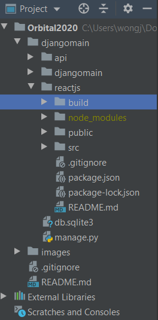
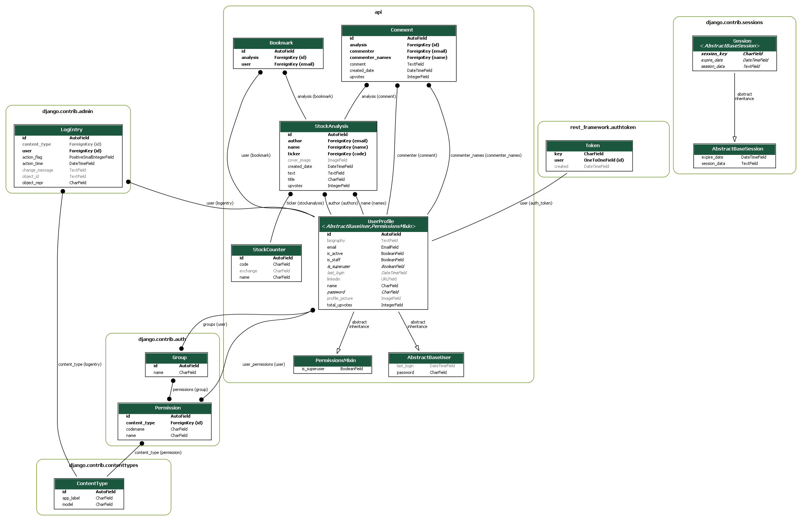

# <center>NUS Orbital Project 2020 - The Free Market [Difficulty : Artemis (Extreme)] </center>

# Team Members:
### Wong Jun Long
### Goh Jun Wei

# Product Documentation :
### https://docs.google.com/document/d/1wFkyn4SZh9oDJtUM8PjQoil9PXARbTNlkCVFNHGsxWw/edit?usp=sharing

# Videos :
### Advertising (Orbital Splashdown) : https://www.youtube.com/watch?v=C_ebTPTghHs&feature=youtu.be
### Full Project : https://www.youtube.com/watch?v=NPXw0UQTv_s&feature=youtu.be

# Deployments :
### Frontend : https://thefreemarket-production.herokuapp.com/
### Backend : https://junlong321.pythonanywhere.com/api/
### Jenkins Continuous Integration : https://34.87.166.226 (We do not provide test accounts as we do not want visitors to alter our continuous integration settings)
### Test Account (For https://thefreemarket-production.herokuapp.com/) :
#### Username : thefifthperson@gmail.com
#### Password : thefifthperson123
#### (PLEASE READ ME!!!) Note that as we are using free servers, our deployments are unstable. Firstly, NewsAPI only can be used on local host, so news page in our deployment is blank. Secondly, press F5 to refresh the pages if the stock analyses do not load. Backend calls from Pythonanywhere is slow and will sometimes cause faulty rendering on the stocks page.

# Set Up Instructions (**Frontend ReactJS**) :
### 1. Clone and pull git repository
### 2. Check package.json file and ensure scripts are notated as below
```
"scripts": {
    "start": "react-scripts start",
    "build": "react-scripts build",
    "test": "react-scripts test",
    "eject": "react-scripts eject"
  },
```
### 3. Open command prompt and change directory to /Orbital2020
### 4. Run **npm install** to install node modules
<strong><font color='red'>npm install</font></strong>
### 5. (OPTIONAL) Run **npm run build** to install static html, css, and js files (You can skip this step if you don't plan to deploy yet)
<strong><font color='red'>npm run build</font></strong>
### 6. Your directory should look something like this. (If you did not run npm run build, you will not have the build folder so don't worry about that)


# Set Up Instructions (**Backend Django**) :
### 1. Clone and pull git repository (**Skip this step if you have already done so**)
### 2. Open command prompt and change directory to /Orbital2020
### 3. Run the following code to install dependencies
<strong><font color='red'>pip install -r requirements.txt</font></strong><br/>
<strong><font color='red'>pip install pillow graphviz pydot django-extensions</strong>

# Django Model Entity Relationship Diagram

###### The above diagram shows the current structure of our SQLite database (Made using GraphViz on Python). The important tables to focus on are those bounded within API. Within API, we have 5 tables, UserProfile, StockCounter, StockAnalysis, Comment, and Bookmark. You can ignore PermissionMixin and AbstractBaseUser as those are classes inherited by the UserProfile model.

###### Notice that there are black lines linking the tables. These black lines represent relationships between the diagrams. When a black line links from one table to another, it means that some fields (To be more specific, those bolded within the individual tables) are used as fields in other tables.

###### The key takeaway from this ERD is that StockCounter and UserProfile are our base models, while StockAnalysis, Comment, and Bookmark are models leveraging on information from the base models.

###### The diagram also gives you a better idea what kind of fields we have in our models. For example, StockCounter holds a unique ID, company name, ticker symbol and stock exchange fields. Note that italic fields in the database ERD are fields which exist in the model and can be called using our backend endpoints, but are hidden when a response is returned in JSON format. Grey fields, on the other hand, are fields which can be left blank when a request is made to the database.

# Django API Endpoints
| Resource Description                                                                                                                                                            | Endpoint            | Methods          | Remarks (Note that Admins are granted access to ALL endpoints)                                                                                                                                                                                                                                                                                                                                                                           |
|---------------------------------------------------------------------------------------------------------------------------------------------------------------------------------|---------------------|------------------|------------------------------------------------------------------------------------------------------------------------------------------------------------------------------------------------------------------------------------------------------------------------------------------------------------------------------------------------------------------------------------------------------------------------------------------|
| When called with a username and password, returns an authentication token. This  authentication token is to be included in the request headers to access The Free Market site. | /api/auth/          | POST             | A POST request (Email + Password) has to be  made to the backend database when logging in to generate an  authentication token.                                                                                                                                                                                                                                                                                                          |
| Shows username, password, and email information of all registered users.                                                                                                        | /api/users/         | GET, POST        | Password is hashed and hidden. Only authenticated users can make a GET request. Unauthenticated users can only make a POST request for registration. Users can be filtered using their names or emails in the search bar.                                                                                                                                                                                                                   |
| Shows individual username, password, and email information of registered users.                                                                                                 | /api/users/{id}/    | GET, PUT, PATCH, DELETE | Password is hashed and hidden. Unauthenticated users are not allowed to access this endpoint. Authenticated users can make a GET request. Authenticated users cannot make a PUT/DELETE request to amend any other users' profile apart from their own.                                                                                                                                                                                   |
| Contains a list of stock names, their associated ticker symbol, and the designated stock exchange that they are found in (e.g SGX, NYSE, NASDAQ, KRX, JPX, IDX, HKEX, etc)      | /api/counters/      | GET, POST        | Counters can be filtered by their name, code or RIC in the search bar. Access to this endpoint is restricted only to Admins. (Users are only allowed to make a GET Request)  We do not want logged in users to modify this information as the stock  counter information will be used in users' financial analysis  in the /api/analyses/ endpoint. If modified indiscriminately,  financial analyses articles written by users may incorrectly  reflect which stock user is analyzing. |
| Contains name, ticker symbol, and the designated stock exchange of a specific stock.                                                                                            | /api/counters/{id}/ | GET, PUT, PATCH, DELETE | Access is restricted only to Admins for reasons mentioned in /api/counters/ endpoint row's Remarks column.                                                                                                                                                                                                                                                                                                                               |
| Shows all financial analyses written by users.                                                                                                                                  | /api/analyses/      | GET, POST        | Unauthenticated users are not allowed to access this endpoint. Authenticated users are allowed to make a GET or POST request. Analyses can be filtered using the author's name or stock name in the search bar.                                                                                                                                                                                                                             |
| Shows a specific financial analysis article written by a given user.                                                                                                                  | /api/analyses/{id}/ | GET, PUT, PATCH, DELETE | Unauthenticated users are not allowed to access this endpoint. Authenticated users are allowed to make a GET request. However, authenticated users cannot make a PUT/DELETE request to amend any other users' analyses apart from their own analyses.                                                                                                                                                                                    |
| Shows all comments written by users on all financial analyses.                                                                                                                  | /api/comments/      | GET, POST        | Unauthenticated users are not allowed to access this endpoint. Authenticated users are allowed to make a GET or POST request. Comments can be filtered using the unique ID of each analysis in the search bar.                                                                                                                                                                                                                              |
| Shows an individual comment written by a specific user on a specific financial analysis.                                                                                        | /api/comments/{id}/ | GET, PUT, PATCH, DELETE | Unauthenticated users are not allowed to access this endpoint. Authenticated users are allowed to make a GET request. However, authenticated users cannot make a PUT/DELETE request to amend any other users' comments apart from their own comments.                                                                                                                                                                                    |
| Shows all bookmarks by all users on all financial analyses.                                                                                                                     | /api/bookmarks/     | GET, POST        | Unauthenticated users are not allowed to access this endpoint. Authenticated users are allowed to make a GET or POST request. Bookmarks can be filtered using the email of the user that bookmarked the analysis in the search bar.                                                                                                                                                                                                         |
| Shows an individual bookmark that a specific user bookmarked on a specific financial analysis.                                                                                  | /api/bookmarks/{id} | GET, PUT, PATCH, DELETE | Unauthenticated users are not allowed to access this endpoint. Authenticated users are allowed to make a GET request. However, authenticated users cannot make a PUT/DELETE request to amend any other users' bookmarks apart from their own bookmarks.                                                                                                                                                                                  |

<!--Search/Filter Results Using Endpoints -->
### <ins><font color='red'>Search/Filter Results Using Endpoints</font></ins>
###### Here, we show how the endpoints can be used to filter specific search results.

| Endpoint        | Filter By These JSON Fields | Example                                                                                                                                                                 | Remarks                                                                                                                                                                                                                         |
|-----------------|-----------------------------|-------------------------------------------------------------------------------------------------------------------------------------------------------------------------|---------------------------------------------------------------------------------------------------------------------------------------------------------------------------------------------------------------------------------|
| /api/auth/      | -                           | -                                                                                                                                                                       | -                                                                                                                                                                                                                               |
| /api/users/     | name, email,                | https://junlong321.pythonanywhere.com/api/users/?search=admin <br/><br/> https://junlong321.pythonanywhere.com/api/users/?search=admin%40gmail.com                                                                 | -                                                                                                                                                                                                                               |
| /api/counters/  | name, code, exchange        | https://junlong321.pythonanywhere.com/api/counters/?search=abc <br/><br/> https://junlong321.pythonanywhere.com/api/counters/?search=abc&limit=5 <br/><br/> https://junlong321.pythonanywhere.com/api/counters/?search=abc&limit=5&offset=100 | abc can refer to the name or code of the stock, or the exchange the stock is located in. limit = 5 returns back the first 5 results of the search. offset = 100 means that we only take results with id=100 and above. |
| /api/analyses/  | author__email, stock__name, | https://junlong321.pythonanywhere.com/api/analyses/?search=admin%40gmail.com <br/><br/> https://junlong321.pythonanywhere.com/api/analyses/?search=AAPL                                                            | -                                                                                                                                                                                                                               |
| /api/comments/  | analysis__id,                | https://junlong321.pythonanywhere.com/api/comments/?search=1 <br/><br/> https://junlong321.pythonanywhere.com/api/comments/?search=2 <br/><br/> https://junlong321.pythonanywhere.com/api/comments/?search=3                                  | search=1 means that we filter the comment with unique id=1                                                                                                                                                                   |
| /api/bookmarks/ | user__email,                | https://junlong321.pythonanywhere.com/api/bookmarks/?search=admin%40gmail.com                                                                                                           | -                                                                                                                                                                                                                               |


<!-- /api//auth/ - POST -->
### <ins><font color='red'>/api/auth/ - POST</font></ins>
###### Parameters : Data (Body)
###### Request Example (HTML FORM):
```
username* : test1@gmail.com
password* : test1
(*) - Compulsory Field
```
###### Response Example :
```
{
  "token": "21ccd4b6b63ff31321e2783c51e81d361e7fb54c"
}
```
###### Response Item : Token
###### Description : Authentication Token
###### Data Type : String

<!-- /api/users/ - GET -->
### <ins><font color='red'>/api/users/ - GET</font></ins>
###### Parameters : -
###### Request Example (HTML FORM) :
```
https://junlong321.pythonanywhere.com/api/users/
```
###### Response Example :
```
[
    {
        "id": 1,
        "email": "admin@gmail.com",
        "name": "admin",
        "biography": null,
        "linkedin": null,
        "profile_picture": null,
        "total_upvotes": 0
    },
    {
        "id": 2,
        "email": "test1@gmail.com",
        "name": "test1",
        "biography": "Hi i am Tester 1",
        "linkedin": "https://www.linkedin.com/in/test1",
        "profile_picture": "https://junlong321.pythonanywhere.com/images/picture.jpg",
        "total_upvotes": 0
    },
    {
        "id": 3,
        "email": "test2@gmail.com",
        "name": "test2",
        "biography": "Hi I am Tester 2",
        "linkedin": "https://www.linkedin.com/in/test2",
        "profile_picture": null,
        "total_upvotes": 0
    }
]
```
###### Description : ID in database is unique. Email and passwords are compulsory fields. Password is hashed and hidden.
###### Response Item : id, email, name, biography, linkedin, profile_picture, total_upvotes
###### Data Type : Integer, String, String, String, String, String, Integer

<!-- /api/users/ - POST -->
### <ins><font color='red'>/api/users/ - POST</font></ins>
###### Parameters : Data (Body)
###### Request Example (HTML FORM) :
```
email* : test1@gmail.com
password* : test1
name* : test1
biography : Hi I am Tester 1
linkedin : https://www.linkedin.com/in/test1
profile_picture : <Choose File>
(*) - Compulsory Field
```
###### Response Example :
```
{
    "id": 2,
    "email": "test1@gmail.com",
    "name": "test1",
    "biography": "Hi i am Tester 1",
    "linkedin": "https://www.linkedin.com/in/test1",
    "profile_picture": "https://junlong321.pythonanywhere.com/images/picture.jpg",
    "total_upvotes": 0
}
```
###### Description : ID in database is unique. Email and passwords are compulsory fields. Password is hashed and hidden.
###### Response Item : id, email, name, biography, linkedin, profile_picture, total_upvotes
###### Data Type : Integer, String, String, String, String, String, Integer

<!-- /api/users/{id} - GET -->
### <ins><font color='red'>/api/users/{id} - GET</font></ins>
###### Parameters : id (Path)
###### Request Example (HTML FORM) :
```
https://junlong321.pythonanywhere.com/api/users/2/
```
###### Response Example :
```
{
    "id": 2,
    "email": "test1@gmail.com",
    "name": "test1",
    "biography": "Hi i am Tester 1",
    "linkedin": "https://www.linkedin.com/in/test1",
    "profile_picture": "https://junlong321.pythonanywhere.com/images/picture.jpg",
    "total_upvotes": 0
}
```
###### Description : ID in database is unique. Email and passwords are compulsory fields. Password is hashed and hidden.
###### Response Item : id, email, name, biography, linkedin, profile_picture, total_upvotes
###### Data Type : Integer, String, String, String, String, String, Integer

<!-- /api/users/{id} - PUT -->
### <ins><font color='red'>/api/users/{id} - PUT</font></ins>
###### Parameters : id (Path) , Data (Body)
###### Request Example (HTML FORM) :
```
https://junlong321.pythonanywhere.com/api/users/2/
email* : test1@gmail.com
password* : test1
name* : test1
biography : Hi I am Tester 1, I made a PUT REQUEST!
(*) - Compulsory Field
```
###### Response Example :
```
{
    "id": 2,
    "email": "test1@gmail.com",
    "name": "test1",
    "biography": Hi I am Tester 1, I made a PUT REQUEST!,
    "linkedin": "https://www.linkedin.com/in/test1",
    "profile_picture": "https://junlong321.pythonanywhere.com/images/picture.jpg",
    "total_upvotes": 0
}
```
###### Description : ID in database is unique. Email and passwords are compulsory fields. Password is hashed and hidden.
###### Response Item : id, email, name, biography, linkedin, profile_picture, total_upvotes
###### Data Type : Integer, String, String, String, String, String, Integer

<!-- /api/users/{id} - PATCH -->
### <ins><font color='red'>/api/users/{id} - PATCH</font></ins>
###### Parameters : id (Path) , Data (Body)
###### Request Example (HTML FORM) :
```
https://junlong321.pythonanywhere.com/api/users/2/
biography : Hi I am Tester 1, I made a PATCH REQUEST!
```
###### Response Example :
```
{
    "id": 2,
    "email": "test1@gmail.com",
    "name": "test1",
    "biography": Hi I am Tester 1, I made a PATCH REQUEST!,
    "linkedin": "https://www.linkedin.com/in/test1",
    "profile_picture": "https://junlong321.pythonanywhere.com/images/picture.jpg",
    "total_upvotes": 0
}
```
###### Description : ID in database is unique. Email and passwords are compulsory fields. Password is hashed and hidden.
###### Response Item : id, email, name, biography, linkedin, profile_picture, total_upvotes
###### Data Type : Integer, String, String, String, String, String, Integer

<!-- /api/users/{id} - DELETE -->
### <ins><font color='red'>/api/users/{id} - DELETE</font></ins>
###### Parameters : id (Path)
###### Request Example (HTML FORM) :
```
https://junlong321.pythonanywhere.com/api/users/2/
```
###### Remarks :
###### Users can only send a DELETE request for deleting their own accounts.

<!-- /api/counters/ - GET -->
### <ins><font color='red'>/api/counters/ - GET</font></ins>
###### Parameters : -
###### Request Example (HTML FORM) :
```
https://junlong321.pythonanywhere.com/api/counters/
```
###### Response Example :
```
[
    {
        "id": 1,
        "name": "Agilent Technologies",
        "code": "A",
        "exchange": "NYSE"
    },
    {
        "id": 2,
        "name": "Alcoa Corp",
        "code": "AA",
        "exchange": "NYSE"
    },
    {
        "id": 3,
        "name": "Aaron's Inc",
        "code": "AAN",
        "exchange": "NYSE"
    }
]
```
###### Description : Name refers to name of stock, code refers to ticker symbol of stock. The Reuters Instrument Code, or RIC, is a ticker-like code used by Thomson Reuters to identify financial instruments and indices
###### Data Type : Integer, String, String, String

<!-- /api/counters/ - POST -->
### <ins><font color='red'>/api/counters/ - POST</font></ins>
###### Parameters : Data (Body)
###### Request Example (HTML FORM) :
```
name* : Agilent Technologies
code* : A
exchange : NYSE
(*) - Compulsory Field
```
###### Response Example :
```
{
    "id": 1,
    "name": "Agilent Technologies",
    "code": "A",
    "exchange": "NYSE"
}
```
###### Description : Name refers to name of stock, code refers to ticker symbol of stock. The Reuters Instrument Code, or RIC, is a ticker-like code used by Thomson Reuters to identify financial instruments and indices
###### Data Type : Integer, String, String, String

<!-- /api/counters/{id}/ - GET -->
### <ins><font color='red'>/api/counters/{id}/ - GET</font></ins>
###### Parameters : id (Path)
###### Request Example (HTML FORM) :
```
https://junlong321.pythonanywhere.com/api/counters/1/
```
###### Response Example :
```
{
    "id": 1,
    "name": "Agilent Technologies",
    "code": "A",
    "exchange": "NYSE"
}
```
###### Description : Name refers to name of stock, code refers to ticker symbol of stock. The Reuters Instrument Code, or RIC, is a ticker-like code used by Thomson Reuters to identify financial instruments and indices
###### Data Type : Integer, String, String, String

<!-- /api/counters/{id}/ - PUT -->
### <ins><font color='red'>/api/counters/{id}/ - PUT</font></ins>
###### Parameters : id (Path)
###### Request Example (HTML FORM) :
```
https://junlong321.pythonanywhere.com/api/counters/1/
name* : Agilent Technologies - PUT REQUEST CALLED
code* : A
(*) - Compulsory Field
```
###### Response Example :
```
{
    "id": 1,
    "name": "Agilent Technologies - PUT REQUEST CALLED",
    "code": "A",
    "exchange": "NYSE"
}
```
###### Description : Name refers to name of stock, code refers to ticker symbol of stock. The Reuters Instrument Code, or RIC, is a ticker-like code used by Thomson Reuters to identify financial instruments and indices
###### Data Type : Integer, String, String, String

<!-- /api/counters/{id}/ - PATCH -->
### <ins><font color='red'>/api/counters/{id}/ - PATCH</font></ins>
###### Parameters : id (Path)
###### Request Example (HTML FORM) :
```
https://junlong321.pythonanywhere.com/api/counters/1/
name : Agilent Technologies - PATCH REQUEST CALLED
```
###### Response Example :
```
{
    "id": 1,
    "name": "Agilent Technologies - PATCH REQUEST CALLED",
    "code": "A",
    "exchange": "NYSE"
}
```
###### Description : Name refers to name of stock, code refers to ticker symbol of stock. The Reuters Instrument Code, or RIC, is a ticker-like code used by Thomson Reuters to identify financial instruments and indices
###### Data Type : Integer, String, String, String

<!-- /api/counters/{id}/ - DELETE -->
### <ins><font color='red'>/api/counters/{id}/ - DELETE</font></ins>
###### Parameters : id (Path)
###### Request Example (HTML FORM) :
```
https://junlong321.pythonanywhere.com/api/counters/1/
```

<!-- /api/analyses/ - GET -->
### <ins><font color='red'>/api/analyses/ - GET</font></ins>
###### Parameters : -
###### Request Example (HTML FORM) :
```
https://junlong321.pythonanywhere.com/api/analyses/
```
###### Response Example :
```
[
    {
        "id": 1,
        "title": "Is Apple Stock A Buy Ahead Of June-Quarter Earnings Report?",
        "text": "Apple (AAPL) saw its shares surge during Wall Street's flight to quality names after the recent coronavirus stock market correction. Analysts hope the consumer electronics giant's financials will spring back quickly when the global economy recovers from the Covid-19 pandemic. With Apple stock on the upswing, many investors are wondering if AAPL stock is a buy right now.\n\nApple has been an American success story several times over. First, it ignited the personal computer revolution in the 1970s with the Apple II. Then it reinvented the PC in the 1980s with the Macintosh.\n\nCo-founder Steve Jobs returned to run Apple in 1997 and oversaw a winning streak of innovations that included the iMac, iPod, iTunes, iPhone, iPad and the App Store.\n\nThe biggest driver of Apple's modern success is the iPhone. The game-changing smartphone, which debuted in 2007, sparked years of massive growth and created a loyal base of customers willing to buy Apple products and services.\n\nBut iPhone sales have slowed as users hold on to their handsets for longer periods between upgrades. However, the company could be on the brink of a major upgrade cycle with its first 5G iPhones, due out this fall.\n\nApple Stock News: 5G iPhone Delay?\nApple usually releases its latest iPhones in September, but market uncertainties related to the coronavirus pandemic could delay the launch.\n\nOn June 4, wireless chipmaker Broadcom (AVGO) signaled that Apple is pushing back the production ramp for its next-generation iPhones by about a month. The news supported earlier media reports that Apple is postponing the iPhone 12 series launch because of manufacturing interruptions in Asia and weakened global consumer demand due to the coronavirus pandemic.\n\nHowever, recent reports from Apple's supply chain indicate that the company is back on for a September launch. Analysts expect the iPhone 12 lineup to include both 4G and 5G handsets.\n\nOn April 15, Apple introduced a lower-cost smartphone aimed at budget-conscious consumers and emerging markets. The second-generation iPhone SE starts at $399.\n\nApple Opportunities For Growth\nWith iPhone growth slowing, investors are wondering what the next big growth driver will be for Apple stock.\n\nLately, two businesses have given Apple's sales and profits a boost: services and wearables.\n\nIn the March quarter, Apple's services revenue rose nearly 17% to $13.35 billion. Services include App Store, AppleCare, iCloud, Apple Pay, Apple Music, Apple TV+, Apple Arcade and other offerings.\n\nOn April 21, Apple launched a major international expansion of its services offerings. It brought the App Store, Apple Arcade, Apple Podcasts and iCloud to 20 more countries and Apple Music to 52 additional countries.\n\nMeanwhile, Apple's Wearables, Home and Accessories unit saw sales jump 22.5% to $6.28 billion in the March quarter. This unit includes wearables like the Apple Watch, AirPods wireless earbuds and Beats headphones. It also contains the Apple HomePod wireless speaker and other miscellaneous gadgets.\n\nApple Earnings: Beat And No Guidance\nOn April 30, the Cupertino, Calif.-based company delivered better-than-expected March-quarter results but withheld guidance.\n\nApple earned $2.55 a share on sales of $58.31 billion in its fiscal second quarter ended March 28. Analysts were looking for earnings of $2.26 a share on sales of $54.54 billion. On a year-over-year basis, Apple earnings rose 4% while sales inched 1% higher.\n\nIn the March quarter, iPhone sales fell 6.7% to $28.96 billion. Mac computer sales dropped 2.9% to $5.35 billion. And iPad tablet sales slid 10.3% to $4.37 billion. Growth in services and wearables helped offset those declines.\n\nApple did not issue guidance for the June quarter, citing market uncertainties related to the coronavirus pandemic. It plans to release its fiscal third-quarter results on July 30.\n\nWall Street predicts Apple earnings of $2 a share on sales of $51.5 billion. In the year-earlier quarter, Apple earnings were $2.18 a share on sales of $53.81 billion.\n\nAAPL Stock News: WWDC Announcements\nOn June 22, Apple kicked off its annual Worldwide Developers Conference. The conference switched from an in-person gathering to an online event this year because of the Covid-19 pandemic.\n\nIn the opening keynote presentation, Apple executives discussed the company's move to in-house processors for Mac computers from Intel (INTC) processors. They also showed off the latest software for the iPhone, iPad, Mac, Apple Watch and Apple TV set-top box.\n\nApple's iOS 14 smartphone operating system will include more customizable home screens, improved Siri assistance, enhanced privacy features, and mini-apps called App Clips. The release, due out this fall, also includes improvements to Maps, Messages and other applications.\n\nExclusive Apple Stock Ratings\nSince the bounce back from the lows of the coronavirus stock market crash, Apple stock has been outperforming the broader market.\n\nAAPL stock has an IBD Relative Strength Rating of 91 out of 99. That puts it in the top 9% of stocks over the past 12 months. In a bullish sign, the stock's relative strength line is in record-high territory. The RS line, the blue line in the charts here, measures a stock's price performance vs. the S&P 500.\n\nApple stock has an IBD Composite Rating of 93 out of 99, according to the IBD Stock Checkup tool.  IBD's Composite Rating combines five separate proprietary ratings of fundamental and technical performance into one easy-to-use rating. The best growth stocks have a Composite Rating of 90 or better.\n\nApple was the first company to reach a market value of over $1 trillion. Since it hit that milestone in August 2018, Microsoft (MSFT), Amazon.com (AMZN) and Google-parent Alphabet (GOOGL) have joined it in the trillion-dollar club.\n\nApple stock was the first to gain a market value of over $1.5 trillion in early June. Amazon and Microsoft have since followed.\n\nAAPL Stock Technical Analysis\nOn April 29, Apple stock broke out of a second-stage cup-with-handle base with a buy point of 288.35, according to IBD MarketSmith charts. It is now extended from that buy point.\n\nThe Dow Jones tech giant recently passed a secondary buy point of 319.79 from a cup-with-handle base visible on a weekly MarketSmith chart. The new buy point is an alternative entry, according to IBD Leaderboard analysis. The breakout here gave investors the opportunity to add to an existing position.\n\nOn July 6, Apple stock notched an all-time high of 375.77 during intraday trading.\n\nIs Apple Stock A Buy Right Now?\nApple stock is not a buy right now. It is trading beyond the 5% chase zone of its last proper breakout. Also, it is trading above the 20%-to-25% profit-taking zone of April 29 breakout, according to IBD trading guidelines.\n\nAAPL stock will need to form a new base in the right market conditions before setting a new potential buy point.\n\nKeep an eye on the overall stock market. Stocks have regained ground lately, but if the trend changes, don't try to fight the general stock market direction.\n\nTo find the best stocks to buy and watch, check out IBD's Stock Lists page. More stock ideas can be found on IBD's Leaderboard and MarketSmith platforms.",
        "created_date": "2020-07-13T14:29:29.739000+08:00",
        "upvotes": 547,
        "cover_image": "https://junlong321.pythonanywhere.com/images/financialhorse_1.png",
        "author": "financialhorse@gmail.com",
        "name": "Financial Horse",
        "ticker": "AAPL"
    },
    {
        "id": 2,
        "title": "Is Microsoft Stock A Buy As Lockdowns Boost Cloud Demand? Here's What Its Stock Chart Shows",
        "text": "Is Microsoft (MSFT) stock a buy, as it stages a brisk recovery following the sell-off triggered by the coronavirus pandemic?\n\nMicrosoft shares have climbed nearly 30% since touching a March 23 low, slightly outpacing the S&P 500's 28.8% gain. Even at the low end of the dive, Microsoft stock held its status in the $1 trillion club — making it briefly the only company in the world with a market capitalization of more than $1 trillion.\n\nApple (AAPL) and Amazon (AMZN) dipped below the trillion-dollar mark during their pullbacks. Both have since rebounded and returned the club to three members.\n\nAll three companies have seen mixed impact — some good, some bad — from the economic effects of the global coronavirus pandemic. Microsoft stock's rebound has been less aggressive than either Apple (up 34.4%), or Amazon (with a 39.2% gain). Amazon stock broke out of a cup base on Tuesday.\n\nBut while Apple works on a possible base pattern, Microsoft has shaped what IBD MarketSmith chart analysis defines as a double-bottom base. It climbed well above its 10-week moving average on Tuesday, moving to within easy striking distance of the buy point. As a double bottom, however, the base is lopsided. A better interpretation is that Microsoft is forming a cup-type base. IBD Leaderboard has identified a 190.80 buy point.\n\nThe megacap cloud-computing stock was first a pre-internet pioneer of the personal computing era, locking down a vast share of the operating systems and software used worldwide. The company now owns LinkedIn, Skype and GitHub, in addition to its legacy Windows operating system and the Xbox gaming and Office 365 businesses. And it has confirmed its status as a leader in cloud-computing services, artificial intelligence and productivity tools, competing toe-to-toe with Amazon.com and Alphabet's (GOOGL) Google.\n\nCloud Computing: JEDI, 5G Infrastructure Deals\nMicrosoft is repeatedly landing infrastructure-scale deals as it plays catch up to Amazon in the global cloud services market. In February, Synergy Research Group put Amazon's share of what it estimates is a $100 billion market at 33%, vs. an 18% share for Microsoft and an 8% share for Google Cloud.\n\nIn October, Microsoft beat out Amazon to land a 10-year U.S. Defense Department cloud-computing contract estimated at $10 billion, according to Bloomberg. Amazon, which was initially awarded what is known as the JEDI, or Joint Enterprise Defense Infrastructure, contract, is contesting the deal, saying that President Donald Trump had biased the Pentagon's bidding process.\n\nIn early February, White House economic advisor Larry Kudlow named the company as a key player in a project to develop a 5G networking protocol that would cut China Huawei out of the implementation of the new broadband networks in the U.S.\n\nMicrosoft reported in mid-March its Teams collaboration software had spiked to 44 million daily active users. That was up from 20 million in November, adding 12 million new users in the week prior to the announcement. Teams provides videoconferencing, team-chat applications, competing with Zoom Video (ZM), Slack Technologies (WORK) and others.\n\nMicrosoft's Pandemic Boost\nMicrosoft ranks among the companies seeing benefits from the massive global shift to at-home workforces, caused by the coronavirus pandemic. A video statement from Microsoft said the company sees the shift as an \"inflection point,\" pointing to a sharp expansion in the global use of such tools.\n\nOn April 9, Microsoft reported Teams traffic had hit a new daily record of 2.7 billion meeting minutes in a single day, a 200% increase from 900 million minutes on March 16.\n\nZoom and Slack offer some functions that Teams does not. Microsoft's Teams suite has document editing and some other capabilities not available through either Zoom or Slack. Teams is available at no charge for business subscribers of Microsoft's Office 365 cloud productivity suite. Also in March, Microsoft announced a number of Teams upgrades, including background noise suppression for conferences and a low-bandwidth chat function that enables conversations over slow internet connections.\n\nFiscal Q2: Another Big Beat\nIn Microsoft's fiscal second-quarter, ended in December, the company once again blew past analyst consensus expectations on both its revenue and earnings lines. Earnings growth accelerated to 37%, rising to $1.51 per share. Revenue growth held steady at 14%, hitting $36.9 billion. Analysts had projected earnings of $1.32 and sales of $35.68 billion, according to Zacks Investment Research.\n\nMicrosoft's $7.5 billion acquisition of GitHub in October 2018 aimed to help drive additional business to its Azure cloud-computing services. A January report this year from RBC Capital projected a 55% year-over-year gain in Azure demand during the quarter. Actual growth for Azure came in at 62%. Growth in the business unit averaged 68% over the prior four quarters\n\nGrowth in Intelligent Cloud unit revenue held steady at 27%, rising to $11.9 billion. Sales of commercial cloud software and services rose 39% to $12.5 billion last quarter.\n\nSales for Microsoft's Productivity and Business Processes segment jumped 17% to $11.8 billion. That segment includes the company's Office, Dynamics and LinkedIn businesses.\n\nMicrosoft reported a gross margin of 66.5% for the quarter, beating the consensus estimate of 64.7%. Moreover, its operating margin of 37.6% exceeded analyst estimates for 34.3%. The company's More Personal Computing segment was under close scrutiny, after constraints in chip supplies pressured the segment's Windows revenue. Segment sales rose 2% during Q2, to $13.2 billion.\n\nAt least 18 analysts raised their price targets on Microsoft stock after the earnings report.\n\nA $136 Billion War Chest\nAlso during Q2, the heavyweight reported it had reduced its long-term debt to $63.36 billion, down slightly vs. Q1 and compared to $69.7 billion at the end of 2018. That held its debt-to-equity ratio around 65%. The number is high relative to smaller software names like Adobe (ADBE), but well below that of others, such as Oracle (ORCL).\n\nHowever, the debt might for now at least be a moot metric. That's because Microsoft's fiscal second quarter report showed total cash, equivalents and short-term investments of $134.25 billion, down slightly from $136.64 billion in the prior quarter. Yes, that's billion — not a typo. So, if worse comes to worst, fundamentally speaking, the outfit is able to cover its bills for a couple of months.\n\nMicrosoft is scheduled to report its fiscal Q3 results after the market closes on April 29.\n\nMicrosoft Stock Technical Analysis\nMicrosoft stock sailed 53% higher in 2019. It climbed another 21% this year, before the coronavirus stock market crash. Shares dived about 30% below that high before starting to recover. On Friday, Microsoft was showing a year-to-date gain of 12%.\n\nMicrosoft's Relative Strength Rating from IBD today is a rock-solid 95. Its relative strength line has angled up to new highs, also a bullish signal.\n\nMicrosoft's Accumulation/Distribution Rating is a C+. That suggests that smart money investors are generally holding or adding to positions, not exiting the stock. The stock's up/down volume ratio of 0.8 is a weak point. You would like to see that number rise above 1.0, which would suggest some upward price pressure on the stock.\n\nInvestors can check a stock's Relative Strength Rating or any other key IBD metric at IBD Stock Checkup.\n\nIs Microsoft A Buy?\nSo, is Microsoft stock a buy? The answer depends on the investor.\n\nFor the average investor, the answer is: Not yet. Microsoft's four-week rally has driven the stock back above both its 40-week and 10-week moving averages, and above the midpoint in what IBD's Leaderboard reads as a nine-week cup base. Shares on Friday were a bit less than 8% below that base's 190.80 buy point.\n\nBut the base can also be construed as a double-bottom base, providing a buy point at 175.10. This is how IBD MarketSmith analysis reads the chart. For more aggressive investors, Microsoft stock is currently a buy — in a buy range above that entry. The buy range runs through 183.85.\n\nAnd for those with an even great tolerance for risk, Microsoft is also a buy. Leaderboard points out an even more aggressive entry at 170.10. Microsoft stock rose past that entry in weak trade on Tuesday. The chase zone for that buy point runs to 178.61.\n\nMicrosoft capitalized on breakouts in February, June and October last year. So its track record is fairly solid.",
        "created_date": "2020-07-13T14:31:37.468000+08:00",
        "upvotes": 439,
        "cover_image": "https://junlong321.pythonanywhere.com/images/financialhorse_2.png",
        "author": "financialhorse@gmail.com",
        "name": "Financial Horse",
        "ticker": "MSFT"
    }
]
```
###### Description : author takes in the unique email of the user writing the analysis. ticker refers to the code of the stock.
###### Response Item : id, title, text, created_date, upvotes, cover_image, author, name, ticker
###### Data Type : Integer, String, String, String, Integer, String, String, String, String

<!-- /api/analyses/ - POST -->
### <ins><font color='red'>/api/analyses/ - POST</font></ins>
###### Parameters : Data (Body)
###### Request Example (HTML FORM) :
```
title* : Is Apple Stock A Buy Ahead Of June-Quarter Earnings Report?
text* : Apple (AAPL) saw its shares surge during Wall Street's flight to quality names after the recent coronavirus stock market correction. Analysts hope the consumer electronics giant's financials will spring back quickly when the global economy recovers from the Covid-19 pandemic. With Apple stock on the upswing, many investors are wondering if AAPL stock is a buy right now.\n\nApple has been an American success story several times over. First, it ignited the personal computer
revolution in the 1970s with the Apple II. Then it reinvented the PC in the 1980s with the Macintosh.\n\nCo-founder Steve Jobs returned to run Apple in 1997 and oversaw a winning streak of innovations that included the iMac, iPod, iTunes, iPhone, iPad and the App Store.\n\nThe biggest driver of Apple's modern success is the iPhone. The game-changing smartphone, which debuted in 2007, sparked years of massive growth and created a loyal base of customers willing to buy Apple products and
services.\n\nBut iPhone sales have slowed as users hold on to their handsets for longer periods between upgrades. However, the company could be on the brink of a major upgrade cycle with its first 5G iPhones, due out this fall.\n\nApple Stock News: 5G iPhone Delay?\nApple usually releases its latest iPhones in September, but market uncertainties related to the coronavirus pandemic could delay the launch.\n\nOn June 4, wireless chipmaker Broadcom (AVGO) signaled that Apple is pushing back
the production ramp for its next-generation iPhones by about a month. The news supported earlier media reports that Apple is postponing the iPhone 12 series launch because of manufacturing interruptions in Asia and weakened global consumer demand due to the coronavirus pandemic.\n\nHowever, recent reports from Apple's supply chain indicate that the company is back on for a September launch. Analysts expect the iPhone 12 lineup to include both 4G and 5G handsets.\n\nOn April 15, Apple
introduced a lower-cost smartphone aimed at budget-conscious consumers and emerging markets. The second-generation iPhone SE starts at $399.\n\nApple Opportunities For Growth\nWith iPhone growth slowing, investors are wondering what the next big growth driver will be for Apple stock.\n\nLately, two businesses have given Apple's sales and profits a boost: services and wearables.\n\nIn the March quarter, Apple's services revenue rose nearly 17% to $13.35 billion. Services include App Store,
AppleCare, iCloud, Apple Pay, Apple Music, Apple TV+, Apple Arcade and other offerings.\n\nOn April 21, Apple launched a major international expansion of its services offerings. It brought the App Store, Apple Arcade, Apple Podcasts and iCloud to 20 more countries and Apple Music to 52 additional countries.\n\nMeanwhile, Apple's Wearables, Home and Accessories unit saw sales jump 22.5% to $6.28 billion in the March quarter. This unit includes wearables like the Apple Watch, AirPods wireless
earbuds and Beats headphones. It also contains the Apple HomePod wireless speaker and other miscellaneous gadgets.\n\nApple Earnings: Beat And No Guidance\nOn April 30, the Cupertino, Calif.-based company delivered better-than-expected March-quarter results but withheld guidance.\n\nApple earned $2.55 a share on sales of $58.31 billion in its fiscal second quarter ended March 28. Analysts were looking for earnings of $2.26 a share on sales of $54.54 billion. On a year-over-year basis, Apple
earnings rose 4% while sales inched 1% higher.\n\nIn the March quarter, iPhone sales fell 6.7% to $28.96 billion. Mac computer sales dropped 2.9% to $5.35 billion. And iPad tablet sales slid 10.3% to $4.37 billion. Growth in services and wearables helped offset those declines.\n\nApple did not issue guidance for the June quarter, citing market uncertainties related to the coronavirus pandemic. It plans to release its fiscal third-quarter results on July 30.\n\nWall Street predicts Apple
earnings of $2 a share on sales of $51.5 billion. In the year-earlier quarter, Apple earnings were $2.18 a share on sales of $53.81 billion.\n\nAAPL Stock News: WWDC Announcements\nOn June 22, Apple kicked off its annual Worldwide Developers Conference. The conference switched from an in-person gathering to an online event this year because of the Covid-19 pandemic.\n\nIn the opening keynote presentation, Apple executives discussed the company's move to in-house processors for Mac computers
from Intel (INTC) processors. They also showed off the latest software for the iPhone, iPad, Mac, Apple Watch and Apple TV set-top box.\n\nApple's iOS 14 smartphone operating system will include more customizable home screens, improved Siri assistance, enhanced privacy features, and mini-apps called App Clips. The release, due out this fall, also includes improvements to Maps, Messages and other applications.\n\nExclusive Apple Stock Ratings\nSince the bounce back from the lows of the coronavirus stock market crash, Apple stock has been outperforming the broader market.\n\nAAPL stock has an IBD Relative Strength Rating of 91 out of 99. That puts it in the top 9% of stocks over the past 12 months. In a bullish sign, the stock's relative strength line is in record-high territory. The RS line, the blue line in the charts here, measures a stock's price performance vs. the S&P 500.\n\nApple stock has an IBD Composite Rating of 93 out of 99, according to the IBD Stock Checkup
tool.  IBD's Composite Rating combines five separate proprietary ratings of fundamental and technical performance into one easy-to-use rating. The best growth stocks have a Composite Rating of 90 or better.\n\nApple was the first company to reach a market value of over $1 trillion. Since it hit that milestone in August 2018, Microsoft (MSFT), Amazon.com (AMZN) and Google-parent Alphabet (GOOGL) have joined it in the trillion-dollar club.\n\nApple stock was the first to gain a market value
of over $1.5 trillion in early June. Amazon and Microsoft have since followed.\n\nAAPL Stock Technical Analysis\nOn April 29, Apple stock broke out of a second-stage cup-with-handle base with a buy point of 288.35, according to IBD MarketSmith charts. It is now extended from that buy point.\n\nThe Dow Jones tech giant recently passed a secondary buy point of 319.79 from a cup-with-handle base visible on a weekly MarketSmith chart. The new buy point is an alternative entry, according to IBD
Leaderboard analysis. The breakout here gave investors the opportunity to add to an existing position.\n\nOn July 6, Apple stock notched an all-time high of 375.77 during intraday trading.\n\nIs Apple Stock A Buy Right Now?\nApple stock is not a buy right now. It is trading beyond the 5% chase zone of its last proper breakout. Also, it is trading above the 20%-to-25% profit-taking zone of April 29 breakout, according to IBD trading guidelines.\n\nAAPL stock will need to form a new base in
the right market conditions before setting a new potential buy point.\n\nKeep an eye on the overall stock market. Stocks have regained ground lately, but if the trend changes, don't try to fight the general stock market direction.\n\nTo find the best stocks to buy and watch, check out IBD's Stock Lists page. More stock ideas can be found on IBD's Leaderboard and MarketSmith platforms."
upvotes : 547
author* : financialhorse@gmail.com
name* : Financial Horse
ticker* : AAPL
cover_image : financialhorse_1.png
(*) - Compulsory Field
```
###### Response Example :
```
{
    "id": 1,
    "title": "Is Apple Stock A Buy Ahead Of June-Quarter Earnings Report?",
    "text": "Apple (AAPL) saw its shares surge during Wall Street's flight to quality names after the recent coronavirus stock market correction. Analysts hope the consumer electronics giant's financials will spring back quickly when the global economy recovers from the Covid-19 pandemic. With Apple stock on the upswing, many investors are wondering if AAPL stock is a buy right now.\n\nApple has been an American success story several times over. First, it ignited the personal computer revolution in the 1970s with the Apple II. Then it reinvented the PC in the 1980s with the Macintosh.\n\nCo-founder Steve Jobs returned to run Apple in 1997 and oversaw a winning streak of innovations that included the iMac, iPod, iTunes, iPhone, iPad and the App Store.\n\nThe biggest driver of Apple's modern success is the iPhone. The game-changing smartphone, which debuted in 2007, sparked years of massive growth and created a loyal base of customers willing to buy Apple products and services.\n\nBut iPhone sales have slowed as users hold on to their handsets for longer periods between upgrades. However, the company could be on the brink of a major upgrade cycle with its first 5G iPhones, due out this fall.\n\nApple Stock News: 5G iPhone Delay?\nApple usually releases its latest iPhones in September, but market uncertainties related to the coronavirus pandemic could delay the launch.\n\nOn June 4, wireless chipmaker Broadcom (AVGO) signaled that Apple is pushing back the production ramp for its next-generation iPhones by about a month. The news supported earlier media reports that Apple is postponing the iPhone 12 series launch because of manufacturing interruptions in Asia and weakened global consumer demand due to the coronavirus pandemic.\n\nHowever, recent reports from Apple's supply chain indicate that the company is back on for a September launch. Analysts expect the iPhone 12 lineup to include both 4G and 5G handsets.\n\nOn April 15, Apple introduced a lower-cost smartphone aimed at budget-conscious consumers and emerging markets. The second-generation iPhone SE starts at $399.\n\nApple Opportunities For Growth\nWith iPhone growth slowing, investors are wondering what the next big growth driver will be for Apple stock.\n\nLately, two businesses have given Apple's sales and profits a boost: services and wearables.\n\nIn the March quarter, Apple's services revenue rose nearly 17% to $13.35 billion. Services include App Store, AppleCare, iCloud, Apple Pay, Apple Music, Apple TV+, Apple Arcade and other offerings.\n\nOn April 21, Apple launched a major international expansion of its services offerings. It brought the App Store, Apple Arcade, Apple Podcasts and iCloud to 20 more countries and Apple Music to 52 additional countries.\n\nMeanwhile, Apple's Wearables, Home and Accessories unit saw sales jump 22.5% to $6.28 billion in the March quarter. This unit includes wearables like the Apple Watch, AirPods wireless earbuds and Beats headphones. It also contains the Apple HomePod wireless speaker and other miscellaneous gadgets.\n\nApple Earnings: Beat And No Guidance\nOn April 30, the Cupertino, Calif.-based company delivered better-than-expected March-quarter results but withheld guidance.\n\nApple earned $2.55 a share on sales of $58.31 billion in its fiscal second quarter ended March 28. Analysts were looking for earnings of $2.26 a share on sales of $54.54 billion. On a year-over-year basis, Apple earnings rose 4% while sales inched 1% higher.\n\nIn the March quarter, iPhone sales fell 6.7% to $28.96 billion. Mac computer sales dropped 2.9% to $5.35 billion. And iPad tablet sales slid 10.3% to $4.37 billion. Growth in services and wearables helped offset those declines.\n\nApple did not issue guidance for the June quarter, citing market uncertainties related to the coronavirus pandemic. It plans to release its fiscal third-quarter results on July 30.\n\nWall Street predicts Apple earnings of $2 a share on sales of $51.5 billion. In the year-earlier quarter, Apple earnings were $2.18 a share on sales of $53.81 billion.\n\nAAPL Stock News: WWDC Announcements\nOn June 22, Apple kicked off its annual Worldwide Developers Conference. The conference switched from an in-person gathering to an online event this year because of the Covid-19 pandemic.\n\nIn the opening keynote presentation, Apple executives discussed the company's move to in-house processors for Mac computers from Intel (INTC) processors. They also showed off the latest software for the iPhone, iPad, Mac, Apple Watch and Apple TV set-top box.\n\nApple's iOS 14 smartphone operating system will include more customizable home screens, improved Siri assistance, enhanced privacy features, and mini-apps called App Clips. The release, due out this fall, also includes improvements to Maps, Messages and other applications.\n\nExclusive Apple Stock Ratings\nSince the bounce back from the lows of the coronavirus stock market crash, Apple stock has been outperforming the broader market.\n\nAAPL stock has an IBD Relative Strength Rating of 91 out of 99. That puts it in the top 9% of stocks over the past 12 months. In a bullish sign, the stock's relative strength line is in record-high territory. The RS line, the blue line in the charts here, measures a stock's price performance vs. the S&P 500.\n\nApple stock has an IBD Composite Rating of 93 out of 99, according to the IBD Stock Checkup tool.  IBD's Composite Rating combines five separate proprietary ratings of fundamental and technical performance into one easy-to-use rating. The best growth stocks have a Composite Rating of 90 or better.\n\nApple was the first company to reach a market value of over $1 trillion. Since it hit that milestone in August 2018, Microsoft (MSFT), Amazon.com (AMZN) and Google-parent Alphabet (GOOGL) have joined it in the trillion-dollar club.\n\nApple stock was the first to gain a market value of over $1.5 trillion in early June. Amazon and Microsoft have since followed.\n\nAAPL Stock Technical Analysis\nOn April 29, Apple stock broke out of a second-stage cup-with-handle base with a buy point of 288.35, according to IBD MarketSmith charts. It is now extended from that buy point.\n\nThe Dow Jones tech giant recently passed a secondary buy point of 319.79 from a cup-with-handle base visible on a weekly MarketSmith chart. The new buy point is an alternative entry, according to IBD Leaderboard analysis. The breakout here gave investors the opportunity to add to an existing position.\n\nOn July 6, Apple stock notched an all-time high of 375.77 during intraday trading.\n\nIs Apple Stock A Buy Right Now?\nApple stock is not a buy right now. It is trading beyond the 5% chase zone of its last proper breakout. Also, it is trading above the 20%-to-25% profit-taking zone of April 29 breakout, according to IBD trading guidelines.\n\nAAPL stock will need to form a new base in the right market conditions before setting a new potential buy point.\n\nKeep an eye on the overall stock market. Stocks have regained ground lately, but if the trend changes, don't try to fight the general stock market direction.\n\nTo find the best stocks to buy and watch, check out IBD's Stock Lists page. More stock ideas can be found on IBD's Leaderboard and MarketSmith platforms.",
    "created_date": "2020-07-13T14:29:29.739000+08:00",
    "upvotes": 547,
    "cover_image": "https://junlong321.pythonanywhere.com/images/financialhorse_1.png",
    "author": "financialhorse@gmail.com",
    "name": "Financial Horse",
    "ticker": "AAPL"
}
```
###### Description : author takes in the unique email of the user writing the analysis. ticker refers to the code of the stock.
###### Response Item : id, title, text, created_date, upvotes, cover_image, author, name, ticker
###### Data Type : Integer, String, String, String, Integer, String, String, String, String

<!-- /api/analyses/{id}/ - GET -->
### <ins><font color='red'>/api/analyses/{id}/ - GET</font></ins>
###### Parameters : id (Path)
###### Request Example (HTML FORM) :
```
https://junlong321.pythonanywhere.com/api/analyses/3/
```
###### Response Example :
```
{
    "id": 3,
    "title": "Is Netflix Stock A Buy Right Now? Here's What NFLX Earnings, Charts Show",
    "text": "Netflix stock spent a lot of time without making progress over the last two years. But last week, it finally punctured the highs hit in June 2018. Despite growing competition, Netflix stock has jumped more than 50% since September. With people staying home due the coronavirus shutdown, streaming content is an obvious beneficiary. But, should you buy Netflix stock now?\n\nNetflix Stock Fundamental Analysis: Weakness Starts A Base\nNetflix (NFLX) has an incredible history of earnings growth. Its average five-year earnings-per-share growth rate is an impressive 83%, according to MarketSmith calculations. Included in that figure is a rather unimpressive showing from the last quarter of 2018 through the middle of 2019. The final quarter of 2018 saw earnings drop 27% from the same quarter the previous year. While earnings grew 19% in the first quarter of 2019, the second-quarter earnings dropped 29%. It led to a flattening of the trailing twelve months earnings per share number and little progress in the stock.\n\nCompounding the problem was a big subscriber miss in July 2019. When Netflix reported second-quarter earnings results after the close on July 17, the decline in earnings was expected. What wasn't expected was a big miss in the subscriber target. The forecast was for Netflix to see new streaming subscriber growth of 5 million and it came in at 2.7 million. That included a loss of domestic subscribers attributed to price increases. The stock gapped down for a 10% loss and started a steep decline in its 2019 base.\n\nTurnaround Starts Before Covid-19 Pandemic\nStarting in the third quarter of 2019, earnings were on a turnaround. Earnings accelerated from the 29% loss of the second quarter in 2019 to 65% growth in the third quarter and 333% growth in the last quarter of 2019. Part of the big boost in the fourth quarter was due to an adjustment of over-accrued taxes, a benefit of the 2017 tax cuts. The end result was a 12-month trailing earnings per share at new highs\n\nAlso in the fourth quarter, Netflix still fell short of its domestic 600,000 target for new subscribers, but less dramatically. Just a couple hundred thousand shy. International subscribers, meanwhile, came in more than a million better than expected at 8.3 million subscribers added for the quarter.\n\nThe stronger fourth quarter set Netflix stock up for a potential breakout for the first time in nearly a year.\n\nNetflix Earnings And The Safer-At-Home Effect\nAs shelter-in-place orders went into place around the world, Netflix stock in particular seemed to be getting a lot of attention. People looked to content providers to fill their extra time at home. Binge watching is certainly easier when you don't have an early commute ahead of you.\n\nThe first quarter was seeing expectations roughly met in the first two months. In March, the coronavirus changed everything. Subscription growth blew away the 8 million estimated by analysts as growth jumped by 15.8 million.\n\nInternational subscriptions have been a large source of revenue growth for the company. In their latest letter to Netflix stock shareholders, management pointed out that over half their revenue is not denominated in the U.S. dollar. The strength in the dollar during the coronavirus economic impact offset a lot of the revenue gains seen internationally. That put the revenue growth of 28% in line with expectations.\n\nAs for earnings, they came in lower than estimates at $1.57 per share vs. an expected $1.65 per share. Still it was an increase of 107% over the prior year. That's deceleration from the 333% growth of the prior quarter but triple digit growth can often make that forgivable.\n\nNetflix Cash Burn An Issue?\nIn the past decade, Netflix transitioned from just a content distributor to a content creator as well. It ventured into original content with the release of \"House of Cards\" in 2013 and introduced a new argument for membership. Subscribing is the only way to access the original programming that now makes up 40% of the content offering according to Raymond James analyst, Justin Patterson.\n\nBut between the content purchased and created, Netflix has a cash burn issue. According to company financial statements, 2018 was more than $3 billion in the hole for non-GAAP free cash flow. That deficit grew to $3.3 billion in 2019 in what was expected to be the peak of negative free cash flow. Their goal of slowly bringing that number to positive originally had a 2020 projection of negative $2.5 billion. But with production halted due to the spread of the coronavirus, some of those cash outlays are uncertain. The company has donated to relief funds to support those affected by production halts, and paid directly those on Netflix projects as a bridge until government stimulus kicked in. But the most recent projections call for just negative $1 billion in free cash flow for 2020 with some of the original outlays pushed to future years. The expectation is for a continued trend toward positive free cash flow but with some added lumpiness. Netflix original content gives them more control and better profit margins, their key to keeping the trend going.\n\nThere is still the question: Will it pay off? It's certainly helping Netflix reach new levels of quality.\n\nCan Quality Programming Spur Subscriber Quantity?\nNetflix came in second for nominations and wins in the 2019 Emmy race, just behind HBO. For the Oscars in 2020, Netflix took the title of most nominations at 24. Though they only won two, it still speaks to an impressive achievement given their original film initiative is under five years old. But can it convert the awards and accolades into more subscribers?\n\nWith the investment in high-quality programming available only to subscribers, Netflix is trying to increase not just its viewership but the time spent using its service. That's where it sees its growth opportunities. In its letter to shareholders from the first quarter 2019, the company emphasized that even in its most mature market, the U.S., TV streaming hours on Netflix only make up 10% of total TV usage. Cable and satellite TV providers still dominate the market. But as viewers shift away from a linear-programming model, Netflix is a contender for a place to land. But the competition is heating up.\n\nWalt Disney (DIS) joined the streaming game as a serious contender with its Disney+ launch in November. Wall Street cheered the announcement, pointing to Disney's huge content library and attractive price point of $6.99. Marvel Comics superheroes and \"Star Wars\" epics, along with other Disney-owned content, will no longer drive viewers to Netflix but rather to the competition.\n\nNetflix says it welcomes the competition. With Disney offering more family-oriented programming, there is certainly room for both. Especially when the combined price tag is only $20 per month. But in the short time since launch, Disney has gained a lot of ground on the domestic subscription numbers of Netflix. Granted, they also have to contend with the rising costs associated with the new service.\n\nFor as much buzz as the new Star Wars series \"The Mandalorian\" got for Disney+, Netflix pointed out their original fantasy series \"The Witcher\" didn't disappoint. In a chart shared by Netflix, they pointed to Google Trends analysis showing higher interest for \"The Witcher\" over \"The Mandalorian.\" The comparison puts Disney+ at a disadvantage, though, as it isn't available in as many regions as Netflix. Still, it does demonstrate the head start Netflix has in reaching a global audience. Sometimes being early makes it hard for others to catch up. Look no further than the many remote controls that offer a Netflix button prominently.\n\nAttacks From Multiple Fronts\nAnd Disney stock isn't the only big-name competitor. Apple (AAPL) is also getting in on the action with its own streaming service, Apple TV+. Apple will also produce original programming, which it just announced with a big splash from celebrities in front of and behind the camera. Their price? Just $4.99 a month as of Nov. 1 last year. It's also free for a year with the purchase of a new iPhone or Apple Watch. However, with less original content available, Apple isn't seeing nearly the same splash as Disney.\n\nStreaming service launches are also coming from networks like Comcast (CMCSA)- owned NBCUniversal and CBS (CBS). Advertising revenue is a key component of the lower price point in their business models. In a letter to Netflix stock investors after the second-quarter earnings report, executives dispelled rumors that Netflix would employ a similar strategy. That decision might be a good one right now in a coronavirus pandemic. Many companies severely reduced their advertising spend. That could give the subscription-based revenue model of Netflix an edge.\n\nIs There Still Room For Growth?\n\nEven with the crowd, many areas, globally and across devices, have a lot of room to grow. With regards to mobile offerings, Greg Peters, chief product officer for Netflix, put it this way: \"Over 97.5% of people around the world are using other different entertainment services, other ways to enjoy their time on their mobile phone,\" he said in a Q&A during a previous earnings call. Making headway there can pay off.\n\nAs Disney has demonstrated for years, viewing popularity can also translate into merchandising opportunities. Netflix took notice and hired Christie Fleischer from Disney as its global head of consumer products. She was the head of merchandise and product development for Disney parks, experiences and consumer products.\n\nAs an example of how this plays out, the Netflix original \"Stranger Things\" touched a nerve for lovers of science fiction and nostalgia with its '80s backdrop. Merchandising opportunities have followed the ardent fan base. In just one example, at the Electronic Entertainment Expo (E3), Nintendo (NTDOY) showcased its \"Stranger Things 3: The Game.\" The game launched along with the third season of the series on July 4 last year.\n\nOpportunities can also come from stores like Hot Topic, which enters into licensing agreements to make T-shirts and other merchandise. Netflix isn't looking to get into the video game or clothing business, but sees the merchandise as a way to cater to avid fan bases and potentially increase them.\n\nNetflix Stock Joins Leaderboard And SwingTrader On Breakout\nIt's been nearly two years since Netflix stock was in new high territory. But the action ahead of the latest earnings report pushed it above 400 for the first time since July 2018. The long base of 2019 tacked on what could be considered a handle with a 393.62 buy point. Netflix cleared it on April 13 and it was added to both Leaderboard and  SwingTrader on that day.\n\nOne could argue that wasn't much time before the earnings report of April 21 but each product had a different strategy on that front. SwingTrader focuses on short-term trades. The expectation was to be out of the stock before the earnings call. SwingTrader took an early entry at 386.02 with half profits taken at 10% and a final exit on April 16 at 445.95 when the stock was up 15.5% from the initial entry and within a percent of its recent high. Better than expected but still done according to plan.\n\nLeaderboard, also took an early entry at 388.92. The goal was to let a profit cushion build up that would allow us to hold through earnings. The plan there came to fruition as well.\n\nNetflix Stock Technical Analysis Of Bases\nIt's still worth revisiting the path Netflix stock took to get here.\n\nIn the bear market of the final quarter in 2018, Netflix stock saw a 40% drop in its base, larger than we like to see. That base failed after announcements by competitors and subscriber misses punished the stock. This more recent base was better, but far from perfect. The weekly chart helps put the correction in perspective.\n\nThe depth of the most recent base is tighter at 34%, which suggests more resilience. It has more symmetry to its movement on both the left and right sides of the cup base. But that is still marred by the big drop in July due to the subscriber miss. Even with its drops, the Netflix stock price still retained a good portion of its 18-month rise that started in 2017. But is it an early- or late-stage base?\n\nAn old Wall Street adage says, \"They either wear you out or scare you out.\" For Netflix stock, it's a little of both.\n\nOne could argue Netflix stock's long hibernation resets the base count. If you haven't been worn out after being down on your stock for two years, you're an investor with stamina. And back-to-back bases that steep most likely scared out the remaining weaker holders. That makes the recent base an early-stage base with the potential for a fresh move. But there's still a glaring flaw in the 2019 base.\n\nRelative Strength Weakens In 2019\nIn the first half of 2019, Netflix stock staged a 36% gain, double that of the S&P 500. The bulk of the gain came from a powerful jump off its lows in the first few weeks of the year. It's the last time its relative strength was impressive. Take that away, and progress in Netflix stock is not so great. As a result, the Relative Strength Rating fell as low as 12 over the summer as Netflix stock went negative for the year. It's made nearly a 50% move off its bottom but the relative strength line, which compares the stock vs. the S&P 500, is still well off its highs.\n\nThere are cases of stocks with weaker relative strength still working out for big gains. Usually this occurs when a stock is basing during a strong move in the rest of the market. Even Apple stock had weak relative strength when it broke out in 2004. Most of the market skyrocketed in 2003 while Apple formed a base, leading to the lower relative strength. Similar to how Netflix stock based in what ended up being a strong 2019.\n\nBut the cases that go on to become true market leaders are certainly rare exceptions. IBD research has found that the average Relative Strength Rating of the best stock market winners hovers around 87 out of a best 99. The 2004 base in Apple stock was much more orderly than what Netflix stock is showing now. Apple also had the benefit of new products and services, iTunes and iPods, to act as an earnings catalyst. Can Netflix stock say the same?\n\nIs Netflix Stock A Buy Right Now?\nWhen all is said and done, Netflix stock turned a corner in 2020. The handle that got tacked on to the 2019 base is really a base in its own right. And the relative strength line is soaring. The S&P 500 fell 35% from its February highs to its March lows. Netflix stock only fell 26% during that time. That quickly sent the relative strength line to new highs and improved the outlook. The S&P 500 had a follow-through day on April 2 and the Nasdaq composite followed suit April 6. That puts the market in a favorable position. While true that not all follow-through days work, Netflix is one of the better looking patterns in the current market environment but is currently extended from its April 13 breakout. It's best to wait for another consolidation before making another purchase.\n\nThe earnings reaction and pause in the market knocked Netflix stock down 6% off its high, but it needs more time to truly give another buying opportunity. The technical and fundamental action are currently painting a better picture than the stock has seen for nearly two years. As such it should remain on your watchlist.",
    "created_date": "2020-07-13T14:35:23.954000+08:00",
    "upvotes": 361,
    "cover_image": "https://junlong321.pythonanywhere.com/images/financialhorse_3.png",
    "author": "financialhorse@gmail.com",
    "name": "Financial Horse",
    "ticker": "NFLX"
}
```
###### Description : author takes in the unique email of the user writing the analysis. ticker refers to the code of the stock.
###### Response Item : id, title, text, created_date, upvotes, cover_image, author, name, ticker
###### Data Type : Integer, String, String, String, Integer, String, String, String, String

<!-- /api/analyses/{id}/ - PUT -->
### <ins><font color='red'>/api/analyses/{id}/ - PUT</font></ins>
###### Parameters : id (Path)
###### Request Example (HTML FORM) :
```
https://junlong321.pythonanywhere.com/api/analyses/1/
title* : Is Apple Stock A Buy Ahead Of June-Quarter Earnings Report?
text* : PUT REQUEST
upvotes : 547
author* : financialhorse@gmail.com
name* : Financial Horse
ticker* : AAPL
cover_image : financialhorse_1.png
(*) - Compulsory Field
```
###### Response Example :
```
{
    "id": 1,
    "title": "Is Apple Stock A Buy Ahead Of June-Quarter Earnings Report?",
    "text": "PUT REQUEST",
    "created_date": "2020-07-13T14:29:29.739000+08:00",
    "upvotes": 547,
    "cover_image": "https://junlong321.pythonanywhere.com/images/financialhorse_1.png",
    "author": "financialhorse@gmail.com",
    "name": "Financial Horse",
    "ticker": "AAPL"
}
```
###### Description : author takes in the unique email of the user writing the analysis. ticker refers to the code of the stock.
###### Response Item : id, title, text, created_date, upvotes, cover_image, author, name, ticker
###### Data Type : Integer, String, String, String, Integer, String, String, String, String

<!-- /api/analyses/{id}/ - PATCH -->
### <ins><font color='red'>/api/analyses/{id}/ - PATCH</font></ins>
###### Parameters : id (Path)
###### Request Example (HTML FORM) :
```
https://junlong321.pythonanywhere.com/api/analyses/1/
text : PATCH REQUEST
```
###### Response Example :
```
{
    "id": 1,
    "title": "Is Apple Stock A Buy Ahead Of June-Quarter Earnings Report?",
    "text": "PATCH REQUEST",
    "created_date": "2020-07-13T14:29:29.739000+08:00",
    "upvotes": 547,
    "cover_image": "https://junlong321.pythonanywhere.com/images/financialhorse_1.png",
    "author": "financialhorse@gmail.com",
    "name": "Financial Horse",
    "ticker": "AAPL"
}
```
###### Description : author takes in the unique email of the user writing the analysis. ticker refers to the code of the stock.
###### Response Item : id, title, text, created_date, upvotes, cover_image, author, name, ticker
###### Data Type : Integer, String, String, String, Integer, String, String, String, String

<!-- /api/analyses/{id}/ - DELETE-->
### <ins><font color='red'>/api/analyses/{id}/ - DELETE</font></ins>
###### Parameters : id (Path)
###### Request Example (HTML FORM) :
```
https://junlong321.pythonanywhere.com/api/analyses/1/
```
###### Remarks :
###### Users can only send a DELETE request for analyses that they have written themselves.

<!-- /api/comments/ - GET -->
### <ins><font color='red'>/api/comments/ - GET</font></ins>
###### Parameters : -
###### Request Example (HTML FORM) :
```
https://junlong321.pythonanywhere.com/api/comments/
```
###### Response Example :
```
[
    {
        "id": 1,
        "comment": "Admin's First Comment",
        "created_date": "2020-06-26T14:51:13.385000+08:00",
        "upvotes": 5,
        "commenter": "admin@gmail.com",
        "analysis": 1
    },
    {
        "id": 2,
        "comment": "Admin's First Comment",
        "created_date": "2020-06-26T14:51:19.646000+08:00",
        "upvotes": 2,
        "commenter": "admin@gmail.com",
        "analysis": 2
    },
    {
        "id": 3,
        "comment": "Admin's First Comment",
        "created_date": "2020-06-26T14:51:23.242000+08:00",
        "upvotes": 2,
        "commenter": "admin@gmail.com",
        "analysis": 3
    }
]
```
###### Description : "analysis" key has a integer assigned to it representing the unique id of the analysis article from the /api/analyses endpoint. We need this key so that we can track which analysis article we should be rendering the comments written to.
###### Response Item : id, comment, created_date, upvotes, commenter, analysis
###### Data Type : Integer, String, String, Integer, String, Integer

<!-- /api/comments/ - POST -->
### <ins><font color='red'>/api/comments/ - POST</font></ins>
###### Parameters : Data (Body)
###### Request Example (HTML FORM) :
```
commenter* : test1
analysis* : admin's ETC Singapore Analysis
comment* : Tester 1's First Comment
upvotes : 5
(*) - Compulsory Field
```
###### Response Example :
```
{
    "id": 7,
    "comment": "Tester 1's First Comment",
    "created_date": "2020-06-26T17:46:07.880053+08:00",
    "upvotes": 5,
    "commenter": "test1@gmail.com",
    "analysis": 1
}
```
###### Description : "analysis" key has a integer assigned to it representing the unique id of the analysis article from the /api/analyses/ endpoint. We need this key so that we can track which analysis article we should be rendering the comments written to.
###### Response Item : id, comment, created_date, upvotes, commenter, analysis
###### Data Type : Integer, String, String, Integer, String, Integer

<!-- /api/comments/{id}/ - GET -->
### <ins><font color='red'>/api/comments/{id}/ - GET</font></ins>
###### Parameters : id (Path)
###### Request Example (HTML FORM) :
```
https://junlong321.pythonanywhere.com/api/comments/7/
```
###### Response Example :
```
{
    "id": 7,
    "comment": "Tester 1's First Comment",
    "created_date": "2020-06-26T17:46:07.880053+08:00",
    "upvotes": 5,
    "commenter": "test1@gmail.com",
    "analysis": 1
}
```
###### Description : "analysis" key has a integer assigned to it representing the unique id of the analysis article from the /api/analyses/ endpoint. We need this key so that we can track which analysis article we should be rendering the comments written to.
###### Response Item : id, comment, created_date, upvotes, commenter, analysis
###### Data Type : Integer, String, String, Integer, String, Integer

<!-- /api/comments/{id}/ - PUT -->
### <ins><font color='red'>/api/comments/{id}/ - PUT</font></ins>
###### Parameters : id (Path)
###### Request Example (HTML FORM) :
```
https://junlong321.pythonanywhere.com/api/comments/7/
commenter* : test1
analysis* : admin's ETC Singapore Analysis
comment* : Tester 1's First Comment, PUT REQUEST CALLED
upvotes : 5
(*) - Compulsory Field
```
###### Response Example :
```
{
    "id": 7,
    "comment": "Tester 1's First Comment, PUT REQUEST CALLED",
    "created_date": "2020-06-26T17:46:07.880053+08:00",
    "upvotes": 5,
    "commenter": "test1@gmail.com",
    "analysis": 1
}
```
###### Description : "analysis" key has a integer assigned to it representing the unique id of the analysis article from the /api/analyses/ endpoint. We need this key so that we can track which analysis article we should be rendering the comments written to.
###### Response Item : id, comment, created_date, upvotes, commenter, analysis
###### Data Type : Integer, String, String, Integer, String, Integer

<!-- /api/comments/{id}/ - PATCH -->
### <ins><font color='red'>/api/comments/{id}/ - PATCH</font></ins>
###### Parameters : id (Path)
###### Request Example (HTML FORM) :
```
https://junlong321.pythonanywhere.com/api/comments/7/
comment : Tester 1's First Comment, PATCH REQUEST CALLED
```
###### Response Example :
```
{
    "id": 7,
    "comment": "Tester 1's First Comment, PATCH REQUEST CALLED",
    "created_date": "2020-06-26T17:46:07.880053+08:00",
    "upvotes": 5,
    "commenter": "test1@gmail.com",
    "analysis": 1
}
```
###### Description : "analysis" key has a integer assigned to it representing the unique id of the analysis article from the /api/analyses/ endpoint. We need this key so that we can track which analysis article we should be rendering the comments written to.
###### Response Item : id, comment, created_date, upvotes, commenter, analysis
###### Data Type : Integer, String, String, Integer, String, Integer

<!-- /api/comments/{id}/ - DELETE-->
### <ins><font color='red'>/api/comments/{id}/ - DELETE</font></ins>
###### Parameters : id (Path)
###### Request Example (HTML FORM) :
```
https://junlong321.pythonanywhere.com/api/comments/7/
```
###### Remarks :
###### Users can only send a DELETE request for comments that they have written themselves.

<!-- /api/bookmarks/ - GET -->
### <ins><font color='red'>/api/bookmarks/ - GET</font></ins>
###### Parameters : -
###### Request Example (HTML FORM) :
```
https://junlong321.pythonanywhere.com/api/bookmarks/
```
###### Response Example :
```
[
    {
        "id": 6,
        "user": "test1@gmail.com",
        "analysis": 1
    },
    {
        "id": 7,
        "user": "test1@gmail.com",
        "analysis": 2
    },
    {
        "id": 8,
        "user": "test1@gmail.com",
        "analysis": 3
    },
    {
        "id": 9,
        "user": "test1@gmail.com",
        "analysis": 4
    },
    {
        "id": 10,
        "user": "test1@gmail.com",
        "analysis": 5
    }
]
```
###### Description : "analysis" key has a integer assigned to it representing the unique id of the analysis article from the /api/analyses endpoint. We need this key so that we can know specifically which article a given user bookmarked.
###### Response Item : id, user, analysis
###### Data Type : Integer, String, Integer

<!-- /api/bookmarks/ - POST -->
### <ins><font color='red'>/api/bookmarks/ - POST</font></ins>
###### Parameters : Data (Body)
###### Request Example (HTML FORM) :
```
user* : test1
analysis* : test1's Beng Kuan Analysis
(*) - Compulsory Field
```
###### Response Example :
```
{
    "id": 8,
    "user": "test1@gmail.com",
    "analysis": 3
}
```
###### Description : "analysis" key has a integer assigned to it representing the unique id of the analysis article from the /api/analyses endpoint. We need this key so that we can know specifically which article a given user bookmarked.
###### Response Item : id, user, analysis
###### Data Type : Integer, String, Integer

<!-- /api/comments/{id}/ - GET -->
### <ins><font color='red'>/api/comments/{id}/ - GET</font></ins>
###### Parameters : id (Path)
###### Request Example (HTML FORM) :
```
https://junlong321.pythonanywhere.com/api/bookmarks/8/
```
###### Response Example :
```
{
    "id": 8,
    "user": "test1@gmail.com",
    "analysis": 3
}
```
###### Description : "analysis" key has a integer assigned to it representing the unique id of the analysis article from the /api/analyses endpoint. We need this key so that we can know specifically which article a given user bookmarked.
###### Response Item : id, user, analysis
###### Data Type : Integer, String, Integer

<!-- /api/bookmarks/{id}/ - PUT -->
### <ins><font color='red'>/api/bookmarks/{id}/ - PUT</font></ins>
###### Parameters : id (Path)
###### Request Example (HTML FORM) :
```
https://junlong321.pythonanywhere.com/api/bookmarks/8/
user* : test1
analysis* : <Analysis with id=4>
(*) - Compulsory Field
```
###### Response Example :
```
{
    "id": 8,
    "user": "test1@gmail.com",
    "analysis": 4
}
```
###### Description : "analysis" key has a integer assigned to it representing the unique id of the analysis article from the /api/analyses endpoint. We need this key so that we can know specifically which article a given user bookmarked.
###### Response Item : id, user, analysis
###### Data Type : Integer, String, Integer

<!-- /api/bookmarks/{id}/ - PATCH -->
### <ins><font color='red'>/api/bookmarks/{id}/ - PATCH</font></ins>
###### Parameters : id (Path)
###### Request Example (HTML FORM) :
```
https://junlong321.pythonanywhere.com/api/bookmarks/8/
analysis : <Analysis with id=4>
```
###### Response Example :
```
{
    "id": 8,
    "user": "test1@gmail.com",
    "analysis": 4
}
```
###### Description : "analysis" key has a integer assigned to it representing the unique id of the analysis article from the /api/analyses endpoint. We need this key so that we can know specifically which article a given user bookmarked.
###### Response Item : id, user, analysis
###### Data Type : Integer, String, Integer

<!-- /api/bookmarks/{id}/ - DELETE-->
### <ins><font color='red'>/api/bookmarks/{id}/ - DELETE</font></ins>
###### Parameters : id (Path)
###### Request Example (HTML FORM) :
```
https://junlong321.pythonanywhere.com/api/bookmarks/7/
```
###### Remarks :
###### Users can only send a DELETE request to remove their own bookmarks.
