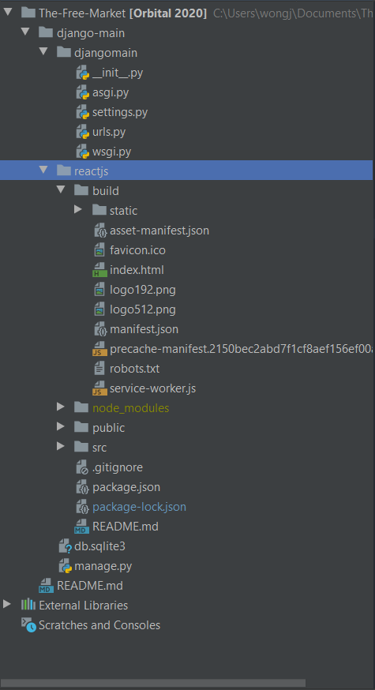

# The-Free-Market
# Orbital Project 2020 (Apollo 11)

## Set Up Instructions :

### 1. Clone Git Repository

### 2. Check package.json file and ensure scripts are notated as below:
```
"scripts": {
    "start": "react-scripts start",
    "build": "react-scripts build",
    "test": "react-scripts test",
    "eject": "react-scripts eject"
  },
```

### 3. Run **npm install** to install node modules
**npm install**

### 4. Run **npm run build** to install static html, css, and js files (Note that you can skip this step if you don't plan to deploy) 
### npm run build is used only for deployment, and is usually followed by calling npm run deploy
**npm run build**

### 5. Your directory should look something like this

