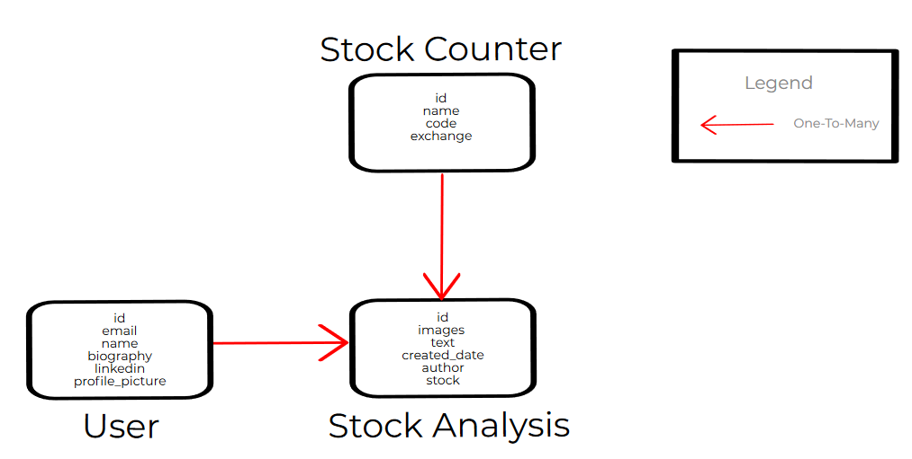

# <center>NUS Orbital Project 2020 - The Free Market [Difficulty : Apollo 11 (Advanced)] </center>

# Set Up Instructions (**Frontend ReactJS**) :
### 1. Clone and pull git repository
### 2. Check package.json file and ensure scripts are notated as below
```
"scripts": {
    "start": "react-scripts start",
    "build": "react-scripts build",
    "test": "react-scripts test",
    "eject": "react-scripts eject"
  },
```
### 3. Open command prompt and change directory to /Orbital2020
### 4. Run **npm install** to install node modules
<strong><font color='red'>npm install</font></strong>
### 5. (OPTIONAL) Run **npm run build** to install static html, css, and js files (You can skip this step if you don't plan to deploy yet)
<strong><font color='red'>npm run build</font></strong>
### 6. Your directory should look something like this. *If you did not run npm run build, you will not have the build folder so don't worry about that*


# Set Up Instructions (**Backend Django**) :
### 1. Clone and pull git repository (**Skip this step if you have already done so**)
### 2. Open command prompt and change directory to /Orbital2020
### 3. Run the following code to install dependencies
<strong><font color='red'>pip install -r requirements.txt</font></strong>

# Django SQLite Database Structure

###### The above diagram shows the current structure of our SQLite database. User table stores details of registered users, while the Stock Counter table stores names and ticker symbols of Stocks and their associated stock exchange that they are found in.

###### The User table has a One-To-Many relationship with Stock Analysis table. **This is because each user can create multiple stock analyses.** Similarly, the Stock Counter table has a One-To-Many relationship with Stock Analysis table. **This is because multiple analyses can be written for any stock counters.**

# Django API Endpoints
| Resource Description | Endpoint | Methods | Remarks |
|-|-|-|-|
| When called with a username and password, returns an authentication token. This  authentication token is to be included in the request headers to access The Free  Market site. | /api/auth/ | POST | A POST request (Email + Password) has to be  made to the backend database when logging in to generate an  authentication token. |
| Shows username, password, and email information of all registered users. | /api/users/ | GET, POST | Password is hashed and hidden. Only authenticated users can make a GET request. Unauthenticated users can only make a  POST request for registration. |
| Shows individual username, password, and email information of registered users. | /api/users/{id}/ | GET, PUT, PATCH, DELETE | Password is hashed and hidden. Unauthenticated users are not allowed to access this endpoint. Authenticated users can make a GET request. Authenticated users cannot make a  PUT/PATCH/DELETE request to amend any other users' profile apart from their own.  |
| Contains a list of stock names, their associated ticker symbol, and the designated stock exchange that they are found in (e.g SGX, NYSE, NASDAQ, KRX, JPX, IDX, HKEX, etc) | /api/counters/ | GET, POST | Access to this endpoint is restricted only to Admins.  We do not want logged in users to modify this information as the stock  counter information will be used in users' financial analysis  in the /api/analyses/ endpoint. If modified indiscriminately,  financial analyses articles written by users may incorrectly  reflect which stock user is analyzing.    |
| Contains name, ticker symbol, and the designated stock exchange of a specific stock. | /api/counters/{id}/ | GET, PUT, PATCH, DELETE | Access is restricted only to Admins for reasons mentioned in  /api/counters/ endpoint row's Remarks column. |
| Shows all financial analyses written by users. | /api/analyses/ | GET, POST | Unauthenticated users are not allowed to access this endpoint. Authenticated users are allowed to make a GET or POST request. |
| Shows a specific financial analysis article written by a user. | /api/analyses/{id}/ | GET, PUT, PATCH, DELETE | Unauthenticated users are not allowed to access this endpoint. Authenticated users can make a GET request. However, authenticated users cannot make a PUT/PATCH/DELETE request to amend any other users' analyses apart from their own analyses. |

<!-- /auth/ - POST -->
### <ins><font color='red'>/auth/ - POST</font></ins>
###### Parameters : Data (Body)
###### Request Example :
```
curl -X POST "http://127.0.0.1:8000/auth/" -H  "accept: application/json" -H  "Content-Type: application/json" -H  "X-CSRFToken: CLk1bFwaJIKXgcaMM4Ypxfkldge51S3CSS6PsXmli7bVsZjkiYvfsyE75uK0XNdZ" -d "{  \"username\": \"YOUREMAIL\",  \"password\": \"YOURPASSWORD\"}"
```
###### Response Example :
```
{
  "token": "b9c9272fac4a20554c994a666dfff4ce1861e1ee"
}
```
###### Response Item : Token
###### Description : Authentication Token
###### Data Type : String

<!-- /api/users/ - GET -->
### <ins><font color='red'>/api/users/ - GET</font></ins>
###### Parameters : -
###### Request Example :
```
curl -X GET "http://127.0.0.1:8000/api/users/" -H  "accept: application/json" -H  "X-CSRFToken: CLk1bFwaJIKXgcaMM4Ypxfkldge51S3CSS6PsXmli7bVsZjkiYvfsyE75uK0XNdZ"
```
###### Response Example :
```
{
    "id": 1,
    "email": "tester@gmail.com",
    "name": "tester",
    "biography": "Hi this is my biography!",
    "linkedin": "https://www.linkedin.com/in/tester",
    "profile_picture": "http://127.0.0.1:8000/images/index.png"
  }
```
###### Response Item : id, email, name, biography, linkedin, profile_picture
###### Description : ID in database is unique. Email and passwords are compulsory fields. Password is hashed and hidden.
###### Data Type : Integer, String, String, String, String, String

<!-- /api/users/ - POST -->
### <ins><font color='red'>/api/users/ - POST</font></ins>
###### Parameters : Data (Body)
###### Request Example :
```
curl -X POST "http://127.0.0.1:8000/api/users/" -H "accept: application/json" -H "Content-Type: application/json" -H "X-CSRFToken: oUibAxYX2VEeN9DnEpQIpB0EbFUy3CpYrok8tDBL3Fk3UNxSsOzqkKqA7C1GbUlK" -d "{ \"email\": \"tester@gmail.com\", \"password\": \"abcdefgABCDEFG\", \"name\": \"tester\", \"biography\": \"Hi this is a POST request!\", \"linkedin\": \"https://www.linkedin.com/in/tester\", \"profile_picture\": "\http://127.0.0.1:8000/images/index.png\"}"
```
###### Response Example :
```
{
    "id": 1,
    "email": "tester@gmail.com",
    "name": "tester",
    "biography": "Hi this is a POST request!",
    "linkedin": "https://www.linkedin.com/in/tester",
    "profile_picture": "http://127.0.0.1:8000/images/index.png"
  }
```
###### Response Item : id, email, name, biography, linkedin, profile_picture
###### Description : ID in database is unique. Email and passwords are compulsory fields. Password is hashed and hidden.
###### Data Type : Integer, String, String, String, String, String

<!-- /api/users/{id} - GET -->
### <ins><font color='red'>/api/users/{id} - GET</font></ins>
###### Parameters : id (Path)
###### Request Example :
```
curl -X GET "http://127.0.0.1:8000/api/users/1/" -H  "accept: application/json" -H  "X-CSRFToken: UGsgqGr4suNOiLJye1UD269kEm3faLAJaNe4HYhf1TeMuyS6KVrtXpt6wAza6GK6"
```
###### Response Example :
```
{
    "id": 1,
    "email": "tester@gmail.com",
    "name": "tester",
    "biography": "Hi this is my biography!",
    "linkedin": "https://www.linkedin.com/in/tester",
    "profile_picture": "http://127.0.0.1:8000/images/index.png"
  }
```
###### Response Item : id, email, name, biography, linkedin, profile_picture
###### Description : ID in database is unique. Email and passwords are compulsory fields. Password is hashed and hidden.
###### Data Type : Integer, String, String, String, String, String

<!-- /api/users/{id} - PUT / PATCH -->
### <ins><font color='red'>/api/users/{id} - PUT/PATCH</font></ins>
###### Parameters : id (Path) , Data (Body)
###### Request Example :
```
curl -X PUT "http://127.0.0.1:8000/api/users/1/" -H "accept: application/json" -H "Content-Type: application/json" -H "X-CSRFToken: oUibAxYX2VEeN9DnEpQIpB0EbFUy3CpYrok8tDBL3Fk3UNxSsOzqkKqA7C1GbUlK" -d "{ \"email\": \"tester@gmail.com\", \"password\": \"abcdefgABCDEFG\", \"name\": \"tester\", \"biography\": \"Hi I made a PUT request!\", \"linkedin\": \"https://www.linkedin.com/in/tester\", \"profile_picture\": "\http://127.0.0.1:8000/images/index.png\"}"
```
###### Response Example :
```
{
    "id": 1,
    "email": "tester@gmail.com",
    "name": "tester",
    "biography": "Hi I made a PUT request!",
    "linkedin": "https://www.linkedin.com/in/tester",
    "profile_picture": "http://127.0.0.1:8000/images/index.png"
  }
```
###### Response Item : id, email, name, biography, linkedin, profile_picture
###### Description : ID in database is unique. Email and passwords are compulsory fields. Password is hashed and hidden.
###### Data Type : Integer, String, String, String, String, String

<!-- /api/users/{id} - DELETE -->
### <ins><font color='red'>/api/users/{id} - DELETE</font></ins>
###### Parameters : id (Path)
###### Request Example :
```
curl -X DELETE "http://127.0.0.1:8000/api/users/1/" -H  "accept: application/json" -H  "X-CSRFToken: vub9uZigCMzhwXjLGFtgvSTC2hu0axqILBXXLh8rbb0fIKsjcz06qbdoUv0V6sA5"
```
###### Remarks :
###### Users can only send a DELETE request for deleting their own accounts.

<!-- /api/counters/ - GET -->
### <ins><font color='red'>/api/counters/ - GET</font></ins>
###### Parameters : -
###### Request Example :
```
curl -X GET "http://127.0.0.1:8000/api/counters/" -H "accept: application/json" -H "X-CSRFToken: 2xEO1wTrJ2rtIeYyWPNNNKvgWWwLBcPE51GLUCwfKM7iPSS3KewvITVcSTDTJuLq"
```
###### Response Example :
```
[
  {
    "id": 1,
    "name": "ACCRELIST LTD",
    "code": "QZG",
    "exchange": "SGX"
  },
  {
    "id": 2,
    "name": "ADVANCED HOLDINGS LTD",
    "code": "BLZ",
    "exchange": "SGX"
  },
  {
    "id": 3,
    "name": "AEM HOLDINGS LTD",
    "code": "AWX",
    "exchange": "SGX"
  }
]
```
###### Response Item : id, name, code, exchange
###### Description : Name refers to name of stock, code refers to ticker symbol of stock, exchange refers to the designated stock exchange that the stock is located in.
###### Data Type : Integer, String, String, String

<!-- /api/counters/ - POST -->
### <ins><font color='red'>/api/counters/ - POST</font></ins>
###### Parameters : Data (Body)
###### Request Example :
```
curl -X POST "http://127.0.0.1:8000/api/counters/" -H "accept: application/json" -H "Content-Type: application/json" -H "X-CSRFToken: 2xEO1wTrJ2rtIeYyWPNNNKvgWWwLBcPE51GLUCwfKM7iPSS3KewvITVcSTDTJuLq" -d "{ \"name\": \"APPLE INC\", \"code\": \"AAPL\", \"exchange\": \"NYSE\"}"
```
###### Response Example :
```
{
  "id": 4,
  "name": "APPLE INC",
  "code": "AAPL",
  "exchange": "NYSE"
}
```
###### Response Item : id, name, code, exchange
###### Description : Name refers to name of stock, code refers to ticker symbol of stock, exchange refers to the designated stock exchange that the stock is located in.
###### Data Type : Integer, String, String, String

<!-- /api/counters/{id}/ - GET -->
### <ins><font color='red'>/api/counters/{id}/ - GET</font></ins>
###### Parameters : id (Path)
###### Request Example :
```
curl -X GET "http://127.0.0.1:8000/api/counters/1/" -H "accept: application/json" -H "X-CSRFToken: 2xEO1wTrJ2rtIeYyWPNNNKvgWWwLBcPE51GLUCwfKM7iPSS3KewvITVcSTDTJuLq"
```
###### Response Example :
```
{
  "id": 1,
  "name": "ACCRELIST LTD",
  "code": "QZG",
  "exchange": "SGX"
}
```
###### Response Item : id, name, code, exchange
###### Description : Name refers to name of stock, code refers to ticker symbol of stock, exchange refers to the designated stock exchange that the stock is located in.
###### Data Type : Integer, String, String, String

<!-- /api/counters/{id}/ - PUT/PATCH -->
### <ins><font color='red'>/api/counters/{id}/ - PUT/PATCH</font></ins>
###### Parameters : id (Path)
###### Request Example :
```
curl -X PUT "http://127.0.0.1:8000/api/counters/4/" -H "accept: application/json" -H "Content-Type: application/json" -H "X-CSRFToken: 2xEO1wTrJ2rtIeYyWPNNNKvgWWwLBcPE51GLUCwfKM7iPSS3KewvITVcSTDTJuLq" -d "{ \"name\": \"UPDATED APPLE INC - PUT CALL\", \"code\": \"AAPL\", \"exchange\": \"NYSE\"}"
```
###### Response Example :
```
{
  "id": 4,
  "name": "UPDATED APPLE INC - PUT CALL",
  "code": "AAPL",
  "exchange": "NYSE"
}
```
###### Response Item : id, name, code, exchange
###### Description : Name refers to name of stock, code refers to ticker symbol of stock, exchange refers to the designated stock exchange that the stock is located in. (Endpoint is strictly for Admin usage)
###### Data Type : Integer, String, String, String

<!-- /api/counters/{id}/ - DELETE -->
### <ins><font color='red'>/api/counters/{id}/ - DELETE</font></ins>
###### Parameters : id (Path)
###### Request Example :
```
curl -X DELETE "http://127.0.0.1:8000/api/counters/4/" -H "accept: application/json" -H "X-CSRFToken: 2xEO1wTrJ2rtIeYyWPNNNKvgWWwLBcPE51GLUCwfKM7iPSS3KewvITVcSTDTJuLq"
```

<!-- /api/analyses/ - GET -->
### <ins><font color='red'>/api/analyses/ - GET</font></ins>
###### Parameters : -
###### Request Example :
```
curl -X GET "http://127.0.0.1:8000/api/analyses/" -H "accept: application/json" -H "X-CSRFToken: 2xEO1wTrJ2rtIeYyWPNNNKvgWWwLBcPE51GLUCwfKM7iPSS3KewvITVcSTDTJuLq"
```
###### Response Example :
```
[
  {
    "id": 1,
    "images": [
      {
        "image": "http://127.0.0.1:8000/images/bea672f15616db24a5f1257435f0a0e2.jpg"
      },
      {
        "image": "http://127.0.0.1:8000/images/download.jpg"
      },
      {
        "image": "http://127.0.0.1:8000/images/index_i9LHoaB.png"
      }
    ],
    "text": "Hi this is my stock analysis",
    "created_date": "2020-06-18T22:33:04.490848+08:00",
    "author": "tester@gmail.com.sg",
    "stock": "AEM HOLDINGS LTD"
  }
 ]
```
###### Response Item : id, images, text, created_date, author, stock
###### Description : When queried, "images" key is made up of "image_1", "image_2", "image_3", .., "image_n" for n images (Though the key is reflected as "image" in the JSON response). created_date will be automatically filled. author takes in the unique email of the user writing the analysis.
###### Data Type : Integer, List of Strings, String, String, String, String

<!-- /api/analyses/ - POST -->
### <ins><font color='red'>/api/analyses/ - POST</font></ins>
###### Parameters : Data (Body)
###### Request Example :
```
curl -X POST "http://127.0.0.1:8000/api/analyses/" -H "accept: application/json" -H "Content-Type: application/json" -H "X-CSRFToken: 2xEO1wTrJ2rtIeYyWPNNNKvgWWwLBcPE51GLUCwfKM7iPSS3KewvITVcSTDTJuLq" -d "{ \"text\": \"Hi this is an analysis post\", \"author\": \"tester@gmail.com.sg\", \"stock\": \"ACCRELIST LTD\"}"
```
###### Response Example :
```
{
  "id": 4,
  "images": [],
  "text": "Hi this is an analysis post",
  "created_date": "2020-06-19T22:16:23.626115+08:00",
  "author": "tester@gmail.com",
  "stock": "ACCRELIST LTD"
}
```
###### Response Item : id, images, text, created_date, author, stock
###### Description : When queried, "images" key is made up of "image_1", "image_2", "image_3", .., "image_n" for n images (Though the key is reflected as "image" in the JSON response). Hence when making a POST request, input your images keys as image_1, image_2, ... , image_n and not just "image". created_date will be automatically filled. author takes in the unique email of the user writing the analysis.
###### Data Type : Integer, List of Strings, String, String, String, String

<!-- /api/analyses/{id}/ - GET -->
### <ins><font color='red'>/api/analyses/{id}/ - GET</font></ins>
###### Parameters : id (Path)
###### Request Example :
```
curl -X GET "http://127.0.0.1:8000/api/analyses/1/" -H "accept: application/json" -H "X-CSRFToken: 2xEO1wTrJ2rtIeYyWPNNNKvgWWwLBcPE51GLUCwfKM7iPSS3KewvITVcSTDTJuLq"
```
###### Response Example :
```
{
  "id": 1,
  "images": [
    {
      "image": "http://127.0.0.1:8000/images/bea672f15616db24a5f1257435f0a0e2.jpg"
    },
    {
      "image": "http://127.0.0.1:8000/images/download.jpg"
    },
    {
      "image": "http://127.0.0.1:8000/images/index_i9LHoaB.png"
    }
  ],
  "text": "Hi this is my stock analysis",
  "created_date": "2020-06-18T22:33:04.490848+08:00",
  "author": "tester@gmail.com.sg",
  "stock": "AEM HOLDINGS LTD"
}
```
###### Response Item : id, images, text, created_date, author, stock
###### Description : When queried, "images" key is made up of "image_1", "image_2", "image_3", .., "image_n" for n images (Though the key is reflected as "image" in the JSON response). created_date will be automatically filled. author takes in the unique email of the user writing the analysis.
###### Data Type : Integer, List of Strings, String, String, String, String

<!-- /api/analyses/{id}/ - PUT/PATCH -->
### <ins><font color='red'>/api/analyses/{id}/ - PUT/PATCH</font></ins>
###### Parameters : id (Path)
###### Request Example :
```
curl -X PUT "http://127.0.0.1:8000/api/analyses/1/" -H "accept: application/json" -H "Content-Type: application/json" -H "X-CSRFToken: 2xEO1wTrJ2rtIeYyWPNNNKvgWWwLBcPE51GLUCwfKM7iPSS3KewvITVcSTDTJuLq" -d "{ \"author\": \"tester@gmail.com.sg\", \"text\": \"This is my updated text using a PUT request\"}"
```
###### Response Example :
```
{
  "id": 1,
  "images": [
    {
      "image": "http://127.0.0.1:8000/images/bea672f15616db24a5f1257435f0a0e2.jpg"
    },
    {
      "image": "http://127.0.0.1:8000/images/download.jpg"
    },
    {
      "image": "http://127.0.0.1:8000/images/index_i9LHoaB.png"
    }
  ],
  "text": "This is my updated text using a PUT request",
  "created_date": "2020-06-18T22:33:04.490848+08:00",
  "author": "tester@gmail.com.sg",
  "stock": "AEM HOLDINGS LTD"
}
```
###### Response Item : id, images, text, created_date, author, stock
###### Description : When queried, "images" key is made up of "image_1", "image_2", "image_3", .., "image_n" for n images (Though the key is reflected as "image" in the JSON response). created_date will be automatically filled. author takes in the unique email of the user writing the analysis.
###### Data Type : Integer, List of Strings, String, String, String, String

<!-- /api/analyses/{id}/ - DELETE-->
### <ins><font color='red'>/api/analyses/{id}/ - DELETE</font></ins>
###### Parameters : id (Path)
###### Request Example :
```
curl -X DELETE "http://127.0.0.1:8000/api/analyses/1/" -H "accept: application/json" -H "X-CSRFToken: 2xEO1wTrJ2rtIeYyWPNNNKvgWWwLBcPE51GLUCwfKM7iPSS3KewvITVcSTDTJuLq"
```
###### Remarks :
###### Users can only send a DELETE request for analyses that they have written themselves.
