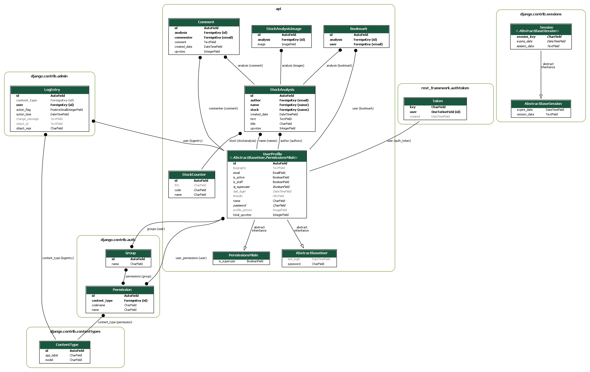

# <center>NUS Orbital Project 2020 - The Free Market [Difficulty : Artemis (Extreme)] </center>

# Set Up Instructions (**Frontend ReactJS**) :
### 1. Clone and pull git repository
### 2. Check package.json file and ensure scripts are notated as below
```
"scripts": {
    "start": "react-scripts start",
    "build": "react-scripts build",
    "test": "react-scripts test",
    "eject": "react-scripts eject"
  },
```
### 3. Open command prompt and change directory to /Orbital2020
### 4. Run **npm install** to install node modules
<strong><font color='red'>npm install</font></strong>
### 5. (OPTIONAL) Run **npm run build** to install static html, css, and js files (You can skip this step if you don't plan to deploy yet)
<strong><font color='red'>npm run build</font></strong>
### 6. Your directory should look something like this. (If you did not run npm run build, you will not have the build folder so don't worry about that)


# Set Up Instructions (**Backend Django**) :
### 1. Clone and pull git repository (**Skip this step if you have already done so**)
### 2. Open command prompt and change directory to /Orbital2020
### 3. Run the following code to install dependencies
<strong><font color='red'>pip install -r requirements.txt</font></strong><br/>
<strong><font color='red'>pip install pillow graphviz pydot django-extensions</strong>

# Django Model Entity Relationship Diagram

###### The above diagram shows the current structure of our SQLite database (Made using GraphViz on Python). The important tables to focus on are those bounded within API. Within API, we have 5 tables, UserProfile, StockCounter, (StockAnalysis + StockAnalysisImage), Comment, and Bookmark. You can ignore PermissionMixin and AbstractBaseUser as those are classes inherited by the UserProfile model, and we consider StockAnalysis and StockAnalysisImage as one model as we nest images within the stock analysis in the database.

###### Notice that there are black lines linking the tables. These black lines represent relationships between the diagrams. When a black line links from one table to another, it means that some fields (To be more specific, those bolded within the individual tables) are used as fields in other tables.

###### The key takeaway from this ERD is that StockCounter and UserProfile are our base models, while (StockAnalysis + StockAnalysisImage), Comment, and Bookmark are models leveraging on information from the base models.

###### The diagram also gives you a better idea what kind of fields we have in our models. For example, StockModel holds unique ID, RIC, code and name fields. This will come in useful when you study our backend documentation further below the README. Note that italic fields in the database ERD are fields which exist in the model and can be called using our backend endpoints, but are hidden when a response is returned in JSON format. Grey fields, on the other hand, are fields which can be left blank when a request is made to the database.

# Django API Endpoints
| Resource Description                                                                                                                                                            | Endpoint            | Methods          | Remarks (Note that Admins are granted access to ALL endpoints)                                                                                                                                                                                                                                                                                                                                                                           |
|---------------------------------------------------------------------------------------------------------------------------------------------------------------------------------|---------------------|------------------|------------------------------------------------------------------------------------------------------------------------------------------------------------------------------------------------------------------------------------------------------------------------------------------------------------------------------------------------------------------------------------------------------------------------------------------|
| When called with a username and password, returns an authentication token. This  authentication token is to be included in the request headers to access The Free Market site. | /api/auth/          | POST             | A POST request (Email + Password) has to be  made to the backend database when logging in to generate an  authentication token.                                                                                                                                                                                                                                                                                                          |
| Shows username, password, and email information of all registered users.                                                                                                        | /api/users/         | GET, POST        | Password is hashed and hidden. Only authenticated users can make a GET request. Unauthenticated users can only make a POST request for registration. Users can be filtered using their names or emails in the search bar.                                                                                                                                                                                                                   |
| Shows individual username, password, and email information of registered users.                                                                                                 | /api/users/{id}/    | GET, PUT, PATCH, DELETE | Password is hashed and hidden. Unauthenticated users are not allowed to access this endpoint. Authenticated users can make a GET request. Authenticated users cannot make a PUT/DELETE request to amend any other users' profile apart from their own.                                                                                                                                                                                   |
| Contains a list of stock names, their associated ticker symbol, and the designated stock exchange that they are found in (e.g SGX, NYSE, NASDAQ, KRX, JPX, IDX, HKEX, etc)      | /api/counters/      | GET, POST        | Counters can be filtered by their name, code or RIC in the search bar. Access to this endpoint is restricted only to Admins.  We do not want logged in users to modify this information as the stock  counter information will be used in users' financial analysis  in the /api/analyses/ endpoint. If modified indiscriminately,  financial analyses articles written by users may incorrectly  reflect which stock user is analyzing. |
| Contains name, ticker symbol, and the designated stock exchange of a specific stock.                                                                                            | /api/counters/{id}/ | GET, PUT, PATCH, DELETE | Access is restricted only to Admins for reasons mentioned in /api/counters/ endpoint row's Remarks column.                                                                                                                                                                                                                                                                                                                               |
| Shows all financial analyses written by users.                                                                                                                                  | /api/analyses/      | GET, POST        | Unauthenticated users are not allowed to access this endpoint. Authenticated users are allowed to make a GET or POST request. Analyses can be filtered using the author's name or stock name in the search bar.                                                                                                                                                                                                                             |
| Shows a specific financial analysis article written by a given user.                                                                                                                  | /api/analyses/{id}/ | GET, PUT, PATCH, DELETE | Unauthenticated users are not allowed to access this endpoint. Authenticated users are allowed to make a GET request. However, authenticated users cannot make a PUT/DELETE request to amend any other users' analyses apart from their own analyses.                                                                                                                                                                                    |
| Shows all comments written by users on all financial analyses.                                                                                                                  | /api/comments/      | GET, POST        | Unauthenticated users are not allowed to access this endpoint. Authenticated users are allowed to make a GET or POST request. Comments can be filtered using the unique ID of each analysis in the search bar.                                                                                                                                                                                                                              |
| Shows an individual comment written by a specific user on a specific financial analysis.                                                                                        | /api/comments/{id}/ | GET, PUT, PATCH, DELETE | Unauthenticated users are not allowed to access this endpoint. Authenticated users are allowed to make a GET request. However, authenticated users cannot make a PUT/DELETE request to amend any other users' comments apart from their own comments.                                                                                                                                                                                    |
| Shows all bookmarks by all users on all financial analyses.                                                                                                                     | /api/bookmarks/     | GET, POST        | Unauthenticated users are not allowed to access this endpoint. Authenticated users are allowed to make a GET or POST request. Bookmarks can be filtered using the email of the user that bookmarked the analysis in the search bar.                                                                                                                                                                                                         |
| Shows an individual bookmark that a specific user bookmarked on a specific financial analysis.                                                                                  | /api/bookmarks/{id} | GET, PUT, PATCH, DELETE | Unauthenticated users are not allowed to access this endpoint. Authenticated users are allowed to make a GET request. However, authenticated users cannot make a PUT/DELETE request to amend any other users' bookmarks apart from their own bookmarks.                                                                                                                                                                                  |

<!--Search/Filter Results Using Endpoints -->
### <ins><font color='red'>Search/Filter Results Using Endpoints</font></ins>
###### Here, we show how the endpoints can be used to filter specific search results.

| Endpoint        | Filter By These JSON Fields | Example                                                                                                                                                                 | Remarks                                                                                                                                                                                                                         |
|-----------------|-----------------------------|-------------------------------------------------------------------------------------------------------------------------------------------------------------------------|---------------------------------------------------------------------------------------------------------------------------------------------------------------------------------------------------------------------------------|
| /api/auth/      | -                           | -                                                                                                                                                                       | -                                                                                                                                                                                                                               |
| /api/users/     | name, email,                | http://127.0.0.1:8000/api/users/?search=admin <br/> http://127.0.0.1:8000/api/users/?search=admin%40gmail.com                                                                 | -                                                                                                                                                                                                                               |
| /api/counters/  | name, code, exchange        | http://127.0.0.1:8000/api/counters/?search=abc <br/> http://127.0.0.1:8000/api/counters/?search=abc&limit=5 <br/> http://127.0.0.1:8000/api/counters/?search=abc&limit=5&offset=100 | abc can refer to the name or code of the stock, or the exchange the stock is located in. limit = 5 returns back the first 5 results of the search. offset = 100 means that we only take results with id=100 and above. |
| /api/analyses/  | author__email, stock__name, | http://127.0.0.1:8000/api/analyses/?search=admin%40gmail.com <br/> http://127.0.0.1:8000/api/analyses/?search=AAPL                                                            | -                                                                                                                                                                                                                               |
| /api/comments/  | analysis__id,                | http://127.0.0.1:8000/api/comments/?search=1 <br/> http://127.0.0.1:8000/api/comments/?search=2 <br/> http://127.0.0.1:8000/api/comments/?search=3                                  | search=1 means that we filter the comment with unique id=1                                                                                                                                                                   |
| /api/bookmarks/ | user__email,                | http://127.0.0.1:8000/api/bookmarks/?search=admin%40gmail.com                                                                                                           | -                                                                                                                                                                                                                               |


<!-- /api//auth/ - POST -->
### <ins><font color='red'>/api/auth/ - POST</font></ins>
###### Parameters : Data (Body)
###### Request Example (HTML FORM):
```
username* : test1@gmail.com
password* : test1
(*) - Compulsory Field
```
###### Response Example :
```
{
  "token": "21ccd4b6b63ff31321e2783c51e81d361e7fb54c"
}
```
###### Response Item : Token
###### Description : Authentication Token
###### Data Type : String

<!-- /api/users/ - GET -->
### <ins><font color='red'>/api/users/ - GET</font></ins>
###### Parameters : -
###### Request Example (HTML FORM) :
```
http://127.0.0.1:8000/api/users/
```
###### Response Example :
```
[
    {
        "id": 1,
        "email": "admin@gmail.com",
        "name": "admin",
        "biography": null,
        "linkedin": null,
        "profile_picture": null,
        "total_upvotes": 0
    },
    {
        "id": 2,
        "email": "test1@gmail.com",
        "name": "test1",
        "biography": "Hi i am Tester 1",
        "linkedin": "https://www.linkedin.com/in/test1",
        "profile_picture": "http://127.0.0.1:8000/images/picture.jpg",
        "total_upvotes": 0
    },
    {
        "id": 3,
        "email": "test2@gmail.com",
        "name": "test2",
        "biography": "Hi I am Tester 2",
        "linkedin": "https://www.linkedin.com/in/test2",
        "profile_picture": null,
        "total_upvotes": 0
    }
]
```
###### Description : ID in database is unique. Email and passwords are compulsory fields. Password is hashed and hidden.
###### Response Item : id, email, name, biography, linkedin, profile_picture, total_upvotes
###### Data Type : Integer, String, String, String, String, String, Integer

<!-- /api/users/ - POST -->
### <ins><font color='red'>/api/users/ - POST</font></ins>
###### Parameters : Data (Body)
###### Request Example (HTML FORM) :
```
email* : test1@gmail.com
password* : test1
name* : test1
biography : Hi I am Tester 1
linkedin : https://www.linkedin.com/in/test1
profile_picture : <Choose File>
(*) - Compulsory Field
```
###### Response Example :
```
{
    "id": 2,
    "email": "test1@gmail.com",
    "name": "test1",
    "biography": "Hi i am Tester 1",
    "linkedin": "https://www.linkedin.com/in/test1",
    "profile_picture": "http://127.0.0.1:8000/images/picture.jpg",
    "total_upvotes": 0
}
```
###### Description : ID in database is unique. Email and passwords are compulsory fields. Password is hashed and hidden.
###### Response Item : id, email, name, biography, linkedin, profile_picture, total_upvotes
###### Data Type : Integer, String, String, String, String, String, Integer

<!-- /api/users/{id} - GET -->
### <ins><font color='red'>/api/users/{id} - GET</font></ins>
###### Parameters : id (Path)
###### Request Example (HTML FORM) :
```
http://127.0.0.1:8000/api/users/2/
```
###### Response Example :
```
{
    "id": 2,
    "email": "test1@gmail.com",
    "name": "test1",
    "biography": "Hi i am Tester 1",
    "linkedin": "https://www.linkedin.com/in/test1",
    "profile_picture": "http://127.0.0.1:8000/images/picture.jpg",
    "total_upvotes": 0
}
```
###### Description : ID in database is unique. Email and passwords are compulsory fields. Password is hashed and hidden.
###### Response Item : id, email, name, biography, linkedin, profile_picture, total_upvotes
###### Data Type : Integer, String, String, String, String, String, Integer

<!-- /api/users/{id} - PUT -->
### <ins><font color='red'>/api/users/{id} - PUT</font></ins>
###### Parameters : id (Path) , Data (Body)
###### Request Example (HTML FORM) :
```
http://127.0.0.1:8000/api/users/2/
email* : test1@gmail.com
password* : test1
name* : test1
biography : Hi I am Tester 1, I made a PUT REQUEST!
(*) - Compulsory Field
```
###### Response Example :
```
{
    "id": 2,
    "email": "test1@gmail.com",
    "name": "test1",
    "biography": Hi I am Tester 1, I made a PUT REQUEST!,
    "linkedin": "https://www.linkedin.com/in/test1",
    "profile_picture": "http://127.0.0.1:8000/images/picture.jpg",
    "total_upvotes": 0
}
```
###### Description : ID in database is unique. Email and passwords are compulsory fields. Password is hashed and hidden.
###### Response Item : id, email, name, biography, linkedin, profile_picture, total_upvotes
###### Data Type : Integer, String, String, String, String, String, Integer

<!-- /api/users/{id} - PATCH -->
### <ins><font color='red'>/api/users/{id} - PATCH</font></ins>
###### Parameters : id (Path) , Data (Body)
###### Request Example (HTML FORM) :
```
http://127.0.0.1:8000/api/users/2/
biography : Hi I am Tester 1, I made a PATCH REQUEST!
```
###### Response Example :
```
{
    "id": 2,
    "email": "test1@gmail.com",
    "name": "test1",
    "biography": Hi I am Tester 1, I made a PATCH REQUEST!,
    "linkedin": "https://www.linkedin.com/in/test1",
    "profile_picture": "http://127.0.0.1:8000/images/picture.jpg",
    "total_upvotes": 0
}
```
###### Description : ID in database is unique. Email and passwords are compulsory fields. Password is hashed and hidden.
###### Response Item : id, email, name, biography, linkedin, profile_picture, total_upvotes
###### Data Type : Integer, String, String, String, String, String, Integer

<!-- /api/users/{id} - DELETE -->
### <ins><font color='red'>/api/users/{id} - DELETE</font></ins>
###### Parameters : id (Path)
###### Request Example (HTML FORM) :
```
http://127.0.0.1:8000/api/users/2/
```
###### Remarks :
###### Users can only send a DELETE request for deleting their own accounts.

<!-- /api/counters/ - GET -->
### <ins><font color='red'>/api/counters/ - GET</font></ins>
###### Parameters : -
###### Request Example (HTML FORM) :
```
http://127.0.0.1:8000/api/counters/
```
###### Response Example :
```
[
    {
        "id": 1,
        "name": "Agilent Technologies",
        "code": "A",
        "exchange": "NYSE"
    },
    {
        "id": 2,
        "name": "Alcoa Corp",
        "code": "AA",
        "exchange": "NYSE"
    },
    {
        "id": 3,
        "name": "Aaron's Inc",
        "code": "AAN",
        "exchange": "NYSE"
    }
]
```
###### Description : Name refers to name of stock, code refers to ticker symbol of stock. The Reuters Instrument Code, or RIC, is a ticker-like code used by Thomson Reuters to identify financial instruments and indices
###### Data Type : Integer, String, String, String

<!-- /api/counters/ - POST -->
### <ins><font color='red'>/api/counters/ - POST</font></ins>
###### Parameters : Data (Body)
###### Request Example (HTML FORM) :
```
name* : Agilent Technologies
code* : A
exchange : NYSE
(*) - Compulsory Field
```
###### Response Example :
```
{
    "id": 1,
    "name": "Agilent Technologies",
    "code": "A",
    "exchange": "NYSE"
}
```
###### Description : Name refers to name of stock, code refers to ticker symbol of stock. The Reuters Instrument Code, or RIC, is a ticker-like code used by Thomson Reuters to identify financial instruments and indices
###### Data Type : Integer, String, String, String

<!-- /api/counters/{id}/ - GET -->
### <ins><font color='red'>/api/counters/{id}/ - GET</font></ins>
###### Parameters : id (Path)
###### Request Example (HTML FORM) :
```
http://127.0.0.1:8000/api/counters/1/
```
###### Response Example :
```
{
    "id": 1,
    "name": "Agilent Technologies",
    "code": "A",
    "exchange": "NYSE"
}
```
###### Description : Name refers to name of stock, code refers to ticker symbol of stock. The Reuters Instrument Code, or RIC, is a ticker-like code used by Thomson Reuters to identify financial instruments and indices
###### Data Type : Integer, String, String, String

<!-- /api/counters/{id}/ - PUT -->
### <ins><font color='red'>/api/counters/{id}/ - PUT</font></ins>
###### Parameters : id (Path)
###### Request Example (HTML FORM) :
```
http://127.0.0.1:8000/api/counters/1/
name* : Agilent Technologies - PUT REQUEST CALLED
code* : A
(*) - Compulsory Field
```
###### Response Example :
```
{
    "id": 1,
    "name": "Agilent Technologies - PUT REQUEST CALLED",
    "code": "A",
    "exchange": "NYSE"
}
```
###### Description : Name refers to name of stock, code refers to ticker symbol of stock. The Reuters Instrument Code, or RIC, is a ticker-like code used by Thomson Reuters to identify financial instruments and indices
###### Data Type : Integer, String, String, String

<!-- /api/counters/{id}/ - PATCH -->
### <ins><font color='red'>/api/counters/{id}/ - PATCH</font></ins>
###### Parameters : id (Path)
###### Request Example (HTML FORM) :
```
http://127.0.0.1:8000/api/counters/1/
name : Agilent Technologies - PATCH REQUEST CALLED
```
###### Response Example :
```
{
    "id": 1,
    "name": "Agilent Technologies - PATCH REQUEST CALLED",
    "code": "A",
    "exchange": "NYSE"
}
```
###### Description : Name refers to name of stock, code refers to ticker symbol of stock. The Reuters Instrument Code, or RIC, is a ticker-like code used by Thomson Reuters to identify financial instruments and indices
###### Data Type : Integer, String, String, String

<!-- /api/counters/{id}/ - DELETE -->
### <ins><font color='red'>/api/counters/{id}/ - DELETE</font></ins>
###### Parameters : id (Path)
###### Request Example (HTML FORM) :
```
http://127.0.0.1:8000/api/counters/1/
```

<!-- /api/analyses/ - GET -->
### <ins><font color='red'>/api/analyses/ - GET</font></ins>
###### Parameters : -
###### Request Example (HTML FORM) :
```
http://127.0.0.1:8000/api/analyses/
```
###### Response Example :
```
[
    {
        "id": 2,
        "images": [],
        "title": "Admin's Second Analysis",
        "text": "Hi This Is Admin's Second Analysis",
        "created_date": "2020-06-26T14:42:42.603000+08:00",
        "upvotes": 2,
        "author": "admin@gmail.com",
        "name": "admin",
        "stock": "Abterra"
    },
    {
        "id": 3,
        "images": [
            {
                "image": "http://127.0.0.1:8000/images/picture1.jpg"
            },
            {
                "image": "http://127.0.0.1:8000/images/picture2.jpg"
            },
            {
                "image": "http://127.0.0.1:8000/images/picture3.jpg"
            }
        ],
        "title": "Tester's First Analysis",
        "text": "Hi This Is Tester 1's First Analysis",
        "created_date": "2020-06-26T14:44:19.697000+08:00",
        "upvotes": 7,
        "author": "test1@gmail.com",
        "name": "test1",
        "stock": "Beng Kuang"
    },
    {
        "id": 4,
        "images": [],
        "title": "Tester 2's First Analysis",
        "text": "Hi This Is Tester 2's First Analysis",
        "created_date": "2020-06-26T14:45:12.620000+08:00",
        "upvotes": 0,
        "author": "test2@gmail.com",
        "name": "test2",
        "stock": "Advanced Systems"
    }
 ]
```
###### Description : When queried, "images" key is made up of "image_1", "image_2", "image_3", .., "image_n" for n images (Though the key is reflected as "image" in the JSON response). created_date will be automatically filled. author takes in the unique email of the user writing the analysis.
###### Response Item : id, images, title, text, created_date, upvotes, author, name, stock
###### Data Type : Integer, List of Strings, String, String, String, Integer, String, String, String

<!-- /api/analyses/ - POST -->
### <ins><font color='red'>/api/analyses/ - POST</font></ins>
###### Parameters : Data (Body)
###### Request Example (HTML FORM) :
```
title* : Tester's First Analysis
text* : Hi This Is Tester 1's First Analysis
upvotes : 7
author* : test1@gmail.com
name* : test1
stock : Beng Kuang
image_1 : picture1.jpg
image_2 : picture2.jpg
image_3 : picture3.jpg
(*) - Compulsory Field
```
###### Response Example :
```
{
    "id": 3,
    "images": [
        {
            "image": "http://127.0.0.1:8000/images/picture1.jpg"
        },
        {
            "image": "http://127.0.0.1:8000/images/picture2.jpg"
        },
        {
            "image": "http://127.0.0.1:8000/images/picture3.jpg"
        }
    ],
    "title": "Tester's First Analysis",
    "text": "Hi This Is Tester 1's First Analysis",
    "created_date": "2020-06-26T14:44:19.697000+08:00",
    "upvotes": 7,
    "author": "test1@gmail.com",
    "name": "test1",
    "stock": "Beng Kuang"
}
```
###### Description : When queried, "images" key is made up of "image_1", "image_2", "image_3", .., "image_n" for n images (Though the key is reflected as "image" in the JSON response). Hence when making a POST request, input your images keys as image_1, image_2, ... , image_n and not just "image". created_date will be automatically filled. author takes in the unique email of the user writing the analysis.
###### Response Item : id, images, title, text, created_date, upvotes, author, name, stock
###### Data Type : Integer, List of Strings, String, String, String, Integer, String, String, String

<!-- /api/analyses/{id}/ - GET -->
### <ins><font color='red'>/api/analyses/{id}/ - GET</font></ins>
###### Parameters : id (Path)
###### Request Example (HTML FORM) :
```
http://127.0.0.1:8000/api/analyses/3/
```
###### Response Example :
```
{
    "id": 3,
    "images": [
        {
            "image": "http://127.0.0.1:8000/images/picture1.jpg"
        },
        {
            "image": "http://127.0.0.1:8000/images/picture2.jpg"
        },
        {
            "image": "http://127.0.0.1:8000/images/picture3.jpg"
        }
    ],
    "title": "Tester's First Analysis",
    "text": "Hi This Is Tester 1's First Analysis",
    "created_date": "2020-06-26T14:44:19.697000+08:00",
    "upvotes": 7,
    "author": "test1@gmail.com",
    "name": "test1",
    "stock": "Beng Kuang"
}
```
###### Description : When queried, "images" key is made up of "image_1", "image_2", "image_3", .., "image_n" for n images (Though the key is reflected as "image" in the JSON response). created_date will be automatically filled. author takes in the unique email of the user writing the analysis.
###### Response Item : id, images, title, text, created_date, upvotes, author, name, stock
###### Data Type : Integer, List of Strings, String, String, String, Integer, String, String, String

<!-- /api/analyses/{id}/ - PUT -->
### <ins><font color='red'>/api/analyses/{id}/ - PUT</font></ins>
###### Parameters : id (Path)
###### Request Example (HTML FORM) :
```
http://127.0.0.1:8000/api/analyses/3/
title* : Tester's First Analysis
text* : Hi This Is Tester 1's First Analysis
upvotes : 7
author* : test1@gmail.com
name* : test1
text : Hi This Is Tester 1's First Analysis, PUT REQUEST CALLED
```
###### Response Example :
```
{
    "id": 3,
    "images": [
        {
            "image": "http://127.0.0.1:8000/images/picture1.jpg"
        },
        {
            "image": "http://127.0.0.1:8000/images/picture2.jpg"
        },
        {
            "image": "http://127.0.0.1:8000/images/picture3.jpg"
        }
    ],
    "title": "Tester's First Analysis",
    "text": "Hi This Is Tester 1's First Analysis, PUT REQUEST CALLED",
    "created_date": "2020-06-26T14:44:19.697000+08:00",
    "upvotes": 7,
    "author": "test1@gmail.com",
    "name": "test1",
    "stock": "Beng Kuang"
}
```
###### Description : When queried, "images" key is made up of "image_1", "image_2", "image_3", .., "image_n" for n images (Though the key is reflected as "image" in the JSON response). created_date will be automatically filled. author takes in the unique email of the user writing the analysis.
###### Response Item : id, images, title, text, created_date, upvotes, author, name, stock
###### Data Type : Integer, List of Strings, String, String, String, Integer, String, String, String

<!-- /api/analyses/{id}/ - PATCH -->
### <ins><font color='red'>/api/analyses/{id}/ - PATCH</font></ins>
###### Parameters : id (Path)
###### Request Example (HTML FORM) :
```
http://127.0.0.1:8000/api/analyses/3/
text : Hi This Is Tester 1's First Analysis, PATCH REQUEST CALLED
```
###### Response Example :
```
{
    "id": 3,
    "images": [
        {
            "image": "http://127.0.0.1:8000/images/picture1.jpg"
        },
        {
            "image": "http://127.0.0.1:8000/images/picture2.jpg"
        },
        {
            "image": "http://127.0.0.1:8000/images/picture3.jpg"
        }
    ],
    "title": "Tester's First Analysis",
    "text": "Hi This Is Tester 1's First Analysis, PATCH REQUEST CALLED",
    "created_date": "2020-06-26T14:44:19.697000+08:00",
    "upvotes": 7,
    "author": "test1@gmail.com",
    "name": "test1",
    "stock": "Beng Kuang"
}
```
###### Description : When queried, "images" key is made up of "image_1", "image_2", "image_3", .., "image_n" for n images (Though the key is reflected as "image" in the JSON response). created_date will be automatically filled. author takes in the unique email of the user writing the analysis.
###### Response Item : id, images, title, text, created_date, upvotes, author, name, stock
###### Data Type : Integer, List of Strings, String, String, String, Integer, String, String, String

<!-- /api/analyses/{id}/ - DELETE-->
### <ins><font color='red'>/api/analyses/{id}/ - DELETE</font></ins>
###### Parameters : id (Path)
###### Request Example (HTML FORM) :
```
http://127.0.0.1:8000/api/analyses/3/
```
###### Remarks :
###### Users can only send a DELETE request for analyses that they have written themselves.

<!-- /api/comments/ - GET -->
### <ins><font color='red'>/api/comments/ - GET</font></ins>
###### Parameters : -
###### Request Example (HTML FORM) :
```
http://127.0.0.1:8000/api/comments/
```
###### Response Example :
```
[
    {
        "id": 1,
        "comment": "Admin's First Comment",
        "created_date": "2020-06-26T14:51:13.385000+08:00",
        "upvotes": 5,
        "commenter": "admin@gmail.com",
        "analysis": 1
    },
    {
        "id": 2,
        "comment": "Admin's First Comment",
        "created_date": "2020-06-26T14:51:19.646000+08:00",
        "upvotes": 2,
        "commenter": "admin@gmail.com",
        "analysis": 2
    },
    {
        "id": 3,
        "comment": "Admin's First Comment",
        "created_date": "2020-06-26T14:51:23.242000+08:00",
        "upvotes": 2,
        "commenter": "admin@gmail.com",
        "analysis": 3
    }
]
```
###### Description : "analysis" key has a integer assigned to it representing the unique id of the analysis article from the /api/analyses endpoint. We need this key so that we can track which analysis article we should be rendering the comments written to.
###### Response Item : id, comment, created_date, upvotes, commenter, analysis
###### Data Type : Integer, String, String, Integer, String, Integer

<!-- /api/comments/ - POST -->
### <ins><font color='red'>/api/comments/ - POST</font></ins>
###### Parameters : Data (Body)
###### Request Example (HTML FORM) :
```
commenter* : test1
analysis* : admin's ETC Singapore Analysis
comment* : Tester 1's First Comment
upvotes : 5
(*) - Compulsory Field
```
###### Response Example :
```
{
    "id": 7,
    "comment": "Tester 1's First Comment",
    "created_date": "2020-06-26T17:46:07.880053+08:00",
    "upvotes": 5,
    "commenter": "test1@gmail.com",
    "analysis": 1
}
```
###### Description : "analysis" key has a integer assigned to it representing the unique id of the analysis article from the /api/analyses/ endpoint. We need this key so that we can track which analysis article we should be rendering the comments written to.
###### Response Item : id, comment, created_date, upvotes, commenter, analysis
###### Data Type : Integer, String, String, Integer, String, Integer

<!-- /api/comments/{id}/ - GET -->
### <ins><font color='red'>/api/comments/{id}/ - GET</font></ins>
###### Parameters : id (Path)
###### Request Example (HTML FORM) :
```
http://127.0.0.1:8000/api/comments/7/
```
###### Response Example :
```
{
    "id": 7,
    "comment": "Tester 1's First Comment",
    "created_date": "2020-06-26T17:46:07.880053+08:00",
    "upvotes": 5,
    "commenter": "test1@gmail.com",
    "analysis": 1
}
```
###### Description : "analysis" key has a integer assigned to it representing the unique id of the analysis article from the /api/analyses/ endpoint. We need this key so that we can track which analysis article we should be rendering the comments written to.
###### Response Item : id, comment, created_date, upvotes, commenter, analysis
###### Data Type : Integer, String, String, Integer, String, Integer

<!-- /api/comments/{id}/ - PUT -->
### <ins><font color='red'>/api/comments/{id}/ - PUT</font></ins>
###### Parameters : id (Path)
###### Request Example (HTML FORM) :
```
http://127.0.0.1:8000/api/comments/7/
commenter* : test1
analysis* : admin's ETC Singapore Analysis
comment* : Tester 1's First Comment, PUT REQUEST CALLED
upvotes : 5
(*) - Compulsory Field
```
###### Response Example :
```
{
    "id": 7,
    "comment": "Tester 1's First Comment, PUT REQUEST CALLED",
    "created_date": "2020-06-26T17:46:07.880053+08:00",
    "upvotes": 5,
    "commenter": "test1@gmail.com",
    "analysis": 1
}
```
###### Description : "analysis" key has a integer assigned to it representing the unique id of the analysis article from the /api/analyses/ endpoint. We need this key so that we can track which analysis article we should be rendering the comments written to.
###### Response Item : id, comment, created_date, upvotes, commenter, analysis
###### Data Type : Integer, String, String, Integer, String, Integer

<!-- /api/comments/{id}/ - PATCH -->
### <ins><font color='red'>/api/comments/{id}/ - PATCH</font></ins>
###### Parameters : id (Path)
###### Request Example (HTML FORM) :
```
http://127.0.0.1:8000/api/comments/7/
comment : Tester 1's First Comment, PATCH REQUEST CALLED
```
###### Response Example :
```
{
    "id": 7,
    "comment": "Tester 1's First Comment, PATCH REQUEST CALLED",
    "created_date": "2020-06-26T17:46:07.880053+08:00",
    "upvotes": 5,
    "commenter": "test1@gmail.com",
    "analysis": 1
}
```
###### Description : "analysis" key has a integer assigned to it representing the unique id of the analysis article from the /api/analyses/ endpoint. We need this key so that we can track which analysis article we should be rendering the comments written to.
###### Response Item : id, comment, created_date, upvotes, commenter, analysis
###### Data Type : Integer, String, String, Integer, String, Integer

<!-- /api/comments/{id}/ - DELETE-->
### <ins><font color='red'>/api/comments/{id}/ - DELETE</font></ins>
###### Parameters : id (Path)
###### Request Example (HTML FORM) :
```
http://127.0.0.1:8000/api/comments/7/
```
###### Remarks :
###### Users can only send a DELETE request for comments that they have written themselves.

<!-- /api/bookmarks/ - GET -->
### <ins><font color='red'>/api/bookmarks/ - GET</font></ins>
###### Parameters : -
###### Request Example (HTML FORM) :
```
http://127.0.0.1:8000/api/bookmarks/
```
###### Response Example :
```
[
    {
        "id": 6,
        "user": "test1@gmail.com",
        "analysis": 1
    },
    {
        "id": 7,
        "user": "test1@gmail.com",
        "analysis": 2
    },
    {
        "id": 8,
        "user": "test1@gmail.com",
        "analysis": 3
    },
    {
        "id": 9,
        "user": "test1@gmail.com",
        "analysis": 4
    },
    {
        "id": 10,
        "user": "test1@gmail.com",
        "analysis": 5
    }
]
```
###### Description : "analysis" key has a integer assigned to it representing the unique id of the analysis article from the /api/analyses endpoint. We need this key so that we can know specifically which article a given user bookmarked.
###### Response Item : id, user, analysis
###### Data Type : Integer, String, Integer

<!-- /api/bookmarks/ - POST -->
### <ins><font color='red'>/api/bookmarks/ - POST</font></ins>
###### Parameters : Data (Body)
###### Request Example (HTML FORM) :
```
user* : test1
analysis* : test1's Beng Kuan Analysis
(*) - Compulsory Field
```
###### Response Example :
```
{
    "id": 8,
    "user": "test1@gmail.com",
    "analysis": 3
}
```
###### Description : "analysis" key has a integer assigned to it representing the unique id of the analysis article from the /api/analyses endpoint. We need this key so that we can know specifically which article a given user bookmarked.
###### Response Item : id, user, analysis
###### Data Type : Integer, String, Integer

<!-- /api/comments/{id}/ - GET -->
### <ins><font color='red'>/api/comments/{id}/ - GET</font></ins>
###### Parameters : id (Path)
###### Request Example (HTML FORM) :
```
http://127.0.0.1:8000/api/bookmarks/8/
```
###### Response Example :
```
{
    "id": 8,
    "user": "test1@gmail.com",
    "analysis": 3
}
```
###### Description : "analysis" key has a integer assigned to it representing the unique id of the analysis article from the /api/analyses endpoint. We need this key so that we can know specifically which article a given user bookmarked.
###### Response Item : id, user, analysis
###### Data Type : Integer, String, Integer

<!-- /api/bookmarks/{id}/ - PUT -->
### <ins><font color='red'>/api/bookmarks/{id}/ - PUT</font></ins>
###### Parameters : id (Path)
###### Request Example (HTML FORM) :
```
http://127.0.0.1:8000/api/bookmarks/8/
user* : test1
analysis* : <Analysis with id=4>
(*) - Compulsory Field
```
###### Response Example :
```
{
    "id": 8,
    "user": "test1@gmail.com",
    "analysis": 4
}
```
###### Description : "analysis" key has a integer assigned to it representing the unique id of the analysis article from the /api/analyses endpoint. We need this key so that we can know specifically which article a given user bookmarked.
###### Response Item : id, user, analysis
###### Data Type : Integer, String, Integer

<!-- /api/bookmarks/{id}/ - PATCH -->
### <ins><font color='red'>/api/bookmarks/{id}/ - PATCH</font></ins>
###### Parameters : id (Path)
###### Request Example (HTML FORM) :
```
http://127.0.0.1:8000/api/bookmarks/8/
analysis : <Analysis with id=4>
```
###### Response Example :
```
{
    "id": 8,
    "user": "test1@gmail.com",
    "analysis": 4
}
```
###### Description : "analysis" key has a integer assigned to it representing the unique id of the analysis article from the /api/analyses endpoint. We need this key so that we can know specifically which article a given user bookmarked.
###### Response Item : id, user, analysis
###### Data Type : Integer, String, Integer

<!-- /api/bookmarks/{id}/ - DELETE-->
### <ins><font color='red'>/api/bookmarks/{id}/ - DELETE</font></ins>
###### Parameters : id (Path)
###### Request Example (HTML FORM) :
```
http://127.0.0.1:8000/api/bookmarks/7/
```
###### Remarks :
###### Users can only send a DELETE request to remove their own bookmarks.
